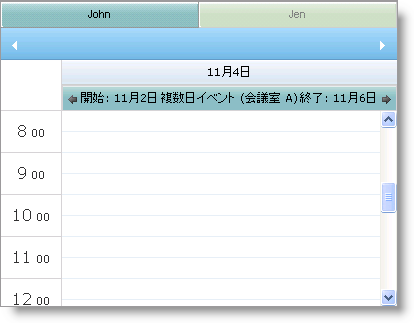
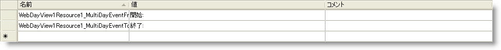
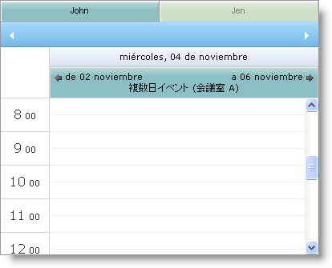

////

|metadata|
{
    "name": "webschedulegenericdataprovider-localize-multi-day-event-banner-caption",
    "controlName": [],
    "tags": ["How Do I"],
    "guid": "{D5DBA8FE-3F1D-4C04-8BBB-D5B16B0AC3C4}",  
    "buildFlags": [],
    "createdOn": "0001-01-01T00:00:00Z"
}
|metadata|
////

= 複数日イベント バナー キャプションのローカライズ

== 始める前に

WebScheduleInfo™ コンポーネントの link:{ApiPlatform}webui.webschedule{ApiVersion}~infragistics.webui.webschedule.webscheduleinfo~enablemultidayeventarrows.html[EnableMultiDayEventArrows] プロパティによって、イベントの発生が開始してから終了するまでの日付の矢印ラベルを表示できます。

これらのラベルは、WebDayView™ および WebMonthView™ コントロールで使用できます。これらのラベルをローカライズする必要がある場合、以下の 2 つのプロパティを使用できます。

* link:{ApiPlatform}webui.webschedule{ApiVersion}~infragistics.webui.webschedule.webdayview~multidayeventfromarrowcaption.html[MultiDayEventFromArrowCaption]
* link:{ApiPlatform}webui.webschedule{ApiVersion}~infragistics.webui.webschedule.webdayview~multidayeventtoarrowcaption.html[MultiDayEventToArrowCaption]

Web ページで WebSchedule コントロールおよび コンポーネントを設定する方法を理解しておく必要があります。

== 達成すること

スペイン語を話す地域用に WebDayView の複数日イベント ラベルをローカライズする方法を学習します。

== 次の手順を実行します

[start=1]
. ASP.NET Web サイトを作成します。
[start=2]
. ページに WebDayView を設定します。詳細は、 link:webschedule-using-the-webschedule-controls-quick-design.html[「WebSchedule コントロールのクイック デザインを使用」]を参照してください。
[start=3]
. ソリューション エクスプローラーでプロジェクトを右クリックして、[新しいアイテムの追加] を選択します。
[start=4]
. 表示するダイアログボックスで [リソース ファイル] を選択します。
[start=5]
. [追加] をクリックします。
[start=6]
. リソース ファイルを App_GlobalResources フォルダに追加するためにプロンプトを承諾します。
[start=7]
. リソース ファイルを開きます。
[start=8]
. WebDayView1Resource1_MultiDayEventFromArrowCaption および WebDayView1Resource1_MultiDayEventToArrowCaption となる名前、そして「開始:」および「終了:」となる値で、複数日イベント矢印にリソース名および値をそれぞれ定義します。

[start=9]
. スペイン語を話す地域用のリソース ファイルを定義するために、リソース ファイルのコピーを作成し、それを Resource.es-Es.resx に名前を変更します。
[start=10]
. 「de」および「a」となる値でスペイン語の値を定義します。

image::images/WebScheduleGenericDataProvider_Localize_Multi_Day_Event_Banner_Caption_03.png[]

[start=11]
. ページのディレクティブで UICulture および Culture を "auto" に設定します。

*HTML の場合:*

----
<%@ Page Language="C#" AutoEventWireup="true" CodeFile="BindingtoDataSourceControl.aspx.cs" Inherits="BindingtoDataSourceControl" UICulture="Auto" Culture="Auto" %>
----

[start=12]
. ページ ロード イベントで、From および To ラベル用のリソース ファイルから定義を使用するために WebDayView を設定します。

*Visual Basic の場合：*

----
Me.WebDayView1.MultiDayEventFromArrowCaption = GetGlobalResourceObject("Resource", "WebDayView1Resource1_MultiDayEventFromArrowCaption").ToString()
Me.WebDayView1.MultiDayEventToArrowCaption = GetGlobalResourceObject("Resource", "WebDayView1Resource1_MultiDayEventToArrowCaption").ToString()
----

*C# の場合：*

----
this.WebDayView1.MultiDayEventFromArrowCaption = GetGlobalResourceObject("Resource", "WebDayView1Resource1_MultiDayEventFromArrowCaption").ToString();
this.WebDayView1.MultiDayEventToArrowCaption = GetGlobalResourceObject("Resource", "WebDayView1Resource1_MultiDayEventToArrowCaption").ToString();
----

[start=13]
. アプリケーションを実行します。スペイン語を使用するように設定されているブラウザで、複数日イベント矢印がスペイン語で表示されます。

== 関連トピック

link:webschedulegenericdataprovider-about-multi-day-event-banner.html[複数日イベント バナーについて]

link:webschedulegenericdataprovider-style-multi-day-event-banner.html[複数日イベント バナーのスタイル]