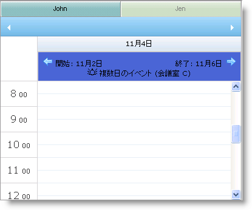

////

|metadata|
{
    "name": "webschedulegenericdataprovider-style-multi-day-event-banner",
    "controlName": [],
    "tags": ["Events","How Do I","Styling"],
    "guid": "{E563D5DE-9205-4BFE-9A40-8C54A7E6FA95}",  
    "buildFlags": [],
    "createdOn": "0001-01-01T00:00:00Z"
}
|metadata|
////

= 複数日イベント バナーのスタイル

複数日をまたがるイベントを表示する場合、複数日イベント矢印の外観をカスタマイズできます。WebMonthView™、WebDayView™ および WebSchedule™ コントロールは、カスタム スタイルを設定できるようにするための link:{ApiPlatform}webui.webschedule{ApiVersion}~infragistics.webui.webschedule.webdayview~multidayeventarrowleftstyle.html[MultiDayEventArrowLeftStyle] および link:{ApiPlatform}webui.webschedule{ApiVersion}~infragistics.webui.webschedule.webdayview~multidayeventarrowrightstyle.html[MultiDayEventArrowRightStyle] プロパティを公開します。

バナー自体のスタイルを変更するには、 link:{ApiPlatform}webui.webschedule{ApiVersion}~infragistics.webui.webschedule.webdayview~alldayeventstyle.html[AllDayEventStyle] プロパティを使用します。

以下のコードは、カスタムの複数日イベント矢印画像を設定して WebDayView のバナーの背景色を変更する方法を示します。

*HTML の場合:*

----

…
<igsch:WebDayView ID="WebDayView1" runat="server" WebScheduleInfoID="WebScheduleInfo1">
    <MultiDayEventArrowLeftStyle CssClass="leftArrow">
    </MultiDayEventArrowLeftStyle>
    <MultiDayEventArrowRightStyle CssClass="rightArrow">
    </MultiDayEventArrowRightStyle>
    <AllDayEventStyle CssClass="banner">
    </AllDayEventStyle>
</igsch:WebDayView>
----

== 関連トピック

link:webschedulegenericdataprovider-about-multi-day-event-banner.html[複数日イベント バナーについて]

link:webschedulegenericdataprovider-localize-multi-day-event-banner-caption.html[複数日イベント バナー キャプションのローカライズ]