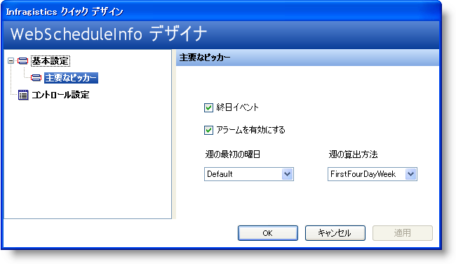
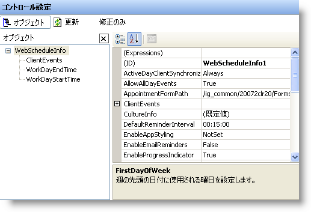
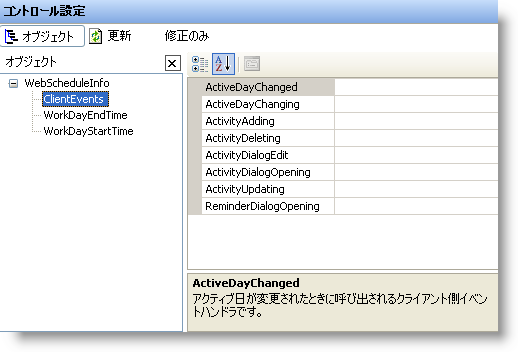

////

|metadata|
{
    "name": "webscheduleinfo-using-webscheduleinfos-designer",
    "controlName": ["WebScheduleInfo"],
    "tags": [],
    "guid": "{2F7964C5-76AA-45B9-ABDE-7B950D9E1F31}",  
    "buildFlags": [],
    "createdOn": "0001-01-01T00:00:00Z"
}
|metadata|
////

= WebScheduleInfo のデザイナを使用

== 始める前に

WebSchedule コントロールはユーザー フレンドリなクイック デザイナが添付されており、コントロールの外観と機能を簡単に設定できます。各コントロールには、機能ピッカー、プリセット、プリセットの管理、コントロール設定などのオプションと同様のレイアウト オプションがあります。これらのオプションは、コントロールに対応する機能がない場合に限り使用できません。

このトピックでは、WebScheduleInfo のクイックデザイナを使用する方法を説明します。これには、デザイナを使用してコントロールにプリセットを適用する方法や、[機能ピッカー] を使用していくつかの標準的な機能を設定する方法が含まれます。

== 次の手順を実行します。

[start=1]
. *新しい ASP.NET プロジェクトを作成します。*
[start=2]
. *Visual Studio .NET ツールボックスからコントロールを追加します。*

デザイナ ビューで Web フォームを開いて、ツールボックスから WebScheduleInfo コントロールをフォームにドラッグします。
[start=3]
. *WebScheduleInfo のデザイナを開きます。*

このコントロールを右クリックして、クイック デザインを選択します。これで WebScheduleInfo のデザイナが起動します。

[NOTE]
====
*注：* 以下のスクリーンショットは実際のサイズよりも小さいですが、ウィンドウを水平方向にスクロールせずにスクリーンショットをトピックに表示できるように切り取ることができます。
====

[start=4]
. *[機能の選択] がロードされます。* WebScheduleInfo デザイナは [機能の選択] が選択された状態でロードされます。[機能ピッカー] は、コントロールをリストしているプロパティ全体をスクロールすることなく、都合のいいところでコントロールの標準的な機能プロパティのいくつかを素早く簡単に設定することができるように設計されています。設定できる機能としては、  pick:[asp-net="link:{ApiPlatform}webui.webschedule{ApiVersion}~infragistics.webui.webschedule.webscheduleinfo~allowalldayevents.html[AllowAllDayEvents]"] 、 pick:[asp-net="link:{ApiPlatform}webui.webschedule{ApiVersion}~infragistics.webui.webschedule.webscheduleinfo~weekrule.html[WeekRule]"] 、および  pick:[asp-net="link:{ApiPlatform}webui.webschedule{ApiVersion}~infragistics.webui.webschedule.webscheduleinfo~enablereminders.html[EnableReminders]"]  が挙げられます。
[start=5]
. *[コントロール設定] 領域を確認します。* Visual Studio .NET の [プロパティ] ダイアログ ボックスに表示されるとおりに、[コントロール設定] 領域が WebScheduleInfo のプロパティ ダイアログ ボックスの右側の領域に表示されます。

[start=6]
. *主要なスタイリング オブジェクトのいくつかで作業をします。*

[コントロール設定] 領域が Visual Studio .NET の [プロパティ] ダイアログ ボックスの上にある利点のひとつは、この領域の中央で、使用したい主要なスタイリング オブジェクトのいくつかを取得する場合に便利なことです。 pick:[asp-net="link:{ApiPlatform}webui.webschedule{ApiVersion}~infragistics.webui.webschedule.webscheduleinfo~clientevents.html[ClientEvents]"]  を選択すると、ウィンドウの右手にある [プロパティ] 領域が特定のスタイルのプロパティを表示するように変わります。

[start=7]
. *変更を適用します。*

WebScheduleInfo デザイナの任意の領域で変更を行う場合には、コントロールに実際に変更が適用されるように、デザイナを閉じる前に左下隅にある [適用] ボタンを必ずクリックしてください。この作業を実行しない場合には、ダイアログ ボックスが表示して、デザイナを終了する前に変更を保存するかどうかを尋ねます。使用可能なさまざまなプロパティのいくつかを使用して単にブラウザする場合は、[いいえ] をクリックしてください。

== 復習

この詳細なガイドは、WebScheduleInfo のクイック デザイナとこのデザイナが提供する利点に対する理解が深まることを目的としています。

== 関連トピック

pick:[asp-net="link:{ApiPlatform}webui.webschedule{ApiVersion}~infragistics.webui.webschedule_namespace.html[WebSchedule 名前空間]"]

pick:[asp-net="link:{ApiPlatform}webui.webschedule{ApiVersion}~infragistics.webui.webschedule.webscheduleinfo.html[WebScheduleInfo クラス]"]

pick:[asp-net="link:{ApiPlatform}webui.webschedule{ApiVersion}~infragistics.webui.webschedule.activity.html[Activity クラス]"]