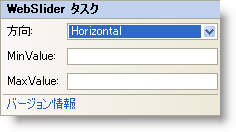

////

|metadata|
{
    "name": "webslider-webslider-smart-tag",
    "controlName": ["WebSlider"],
    "tags": ["How Do I"],
    "guid": "{FF9D4E0A-E583-469F-8299-16F2D62105A7}",  
    "buildFlags": [],
    "createdOn": "0001-01-01T00:00:00Z"
}
|metadata|
////

= WebSlider スマート タグ

Visual Studio 2005/2008（.NET Framework 2.0/3.5）では、{ProductName} の個々のコントロール/コンポーネントにはスマート タグがあります。コントロールやコンポーネントを選択するだけで、スマート タグのアンカーが表示されます。このアンカーをクリックするとポップアップ パネルが表示され、そこからコントロール/コンポーネントの最もよく使うプロパティや設定にすばやく簡単にアクセスできます。

WebSlider™ のスマート タグには次のセクションが含まれています。

* Orientation -- WebSlider の方向（水平または垂直のいずれか）を選択することができます。
* MinValue -- WebSlider の最小値。
* MaxValue -- WebSlider の最大値。

各セクションの項目（フィールド、ドロップダウン リスト、チェックボックスなど）の説明と、各項目が対応するプロパティ グリッドのプロパティについては、以下の表を参照してください。

WebSlider のスマート タグには次のリンクが含まれています。

* バージョン情報 -- これをクリックすると WebSlider の製品情報を開きます。ステータス、バージョン、有効期限、製品キーなどの情報が含まれます。

[options="header", cols="a,a,a"]
|====
|項目|説明|対応するプロパティ

|Orientation
|ドロップダウン ボックスによって、WebSlider の方向（水平または垂直）を選択することができます。
|*Orientation*

|MinValue
|WebSlider の編集可能な範囲の最小値を指定することができます。
|*MinValue*

|MaxValue
|WebSlider の編集可能な範囲の最大値を指定することができます。
|*MaxValue*

|====