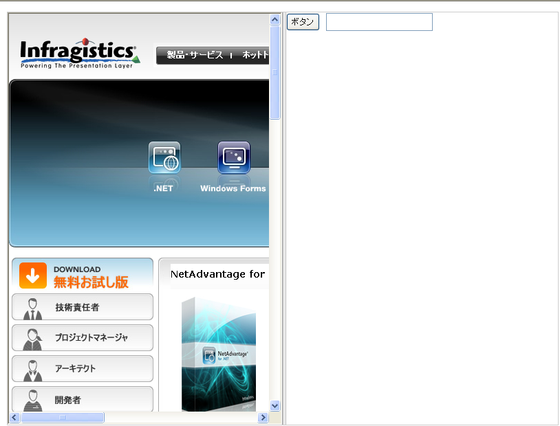

////

|metadata|
{
    "name": "websplitter-getting-started-with-the-websplitter",
    "controlName": ["WebSplitter"],
    "tags": ["Getting Started"],
    "guid": "{529307D7-9646-4631-9B8C-D9BC07BFB52A}",  
    "buildFlags": [],
    "createdOn": "2008-12-01T21:08:16Z"
}
|metadata|
////

= WebSplitter で開始

== 始める前に

以下の手順は、WebSplitter™ を開始する方法を示します。

*以下の手順の前提は以下のとおりです。*

* Getting_Started_with_the_WebSplitter という名前を指定した新しい ASP.NET AJAX 対応の Web サイトをすでに作成している。
* WebForm 上に ASP.NET AJAX ScriptManager インスタンスがある。
* このアプリケーションで Infragistics Application Styling を有効にしており、Default Style を使用している。これの実行方法の詳細は、 link:web-enabling-application-styling-using-the-web-config-file.html[「web.config ファイルを使用してアプリケーション スタイリングを有効にする」]を参照してください。

== 達成すること

読み終わると、3 つのコンテンツ ペインを含む WebSplitter コントロールのインスタンスを持つ WebForm が作成され、それぞれがざまざまなコンテンツを含むようになります。

== 次の手順を実行します。

[start=1]
. Visual Studio Toolbox で、WebSplitter を指定してダブルクリックします。これで WebSplitter コントロールのインスタンスを WebForm に配置することになります。
[start=2]
. WebSplitter コントロールをクリックして、[プロパティ] ウィンドウで Height プロパティを指定して 600px に設定します。Width のプロパティを指定して 800px に設定します。
[start=3]
. [プロパティ] ウィンドウで、 pick:[asp-net="link:{ApiPlatform}web{ApiVersion}~infragistics.web.ui.layoutcontrols.websplitter~orientation.html[Orientation]"]  プロパティを指定し Vertical に設定します。
[start=4]
. 次にいくつかのコンテンツ ペインを WebSplitter コントロールに追加します。[プロパティ] ウィンドウで、 pick:[asp-net="link:{ApiPlatform}web{ApiVersion}~infragistics.web.ui.layoutcontrols.websplitter~panes.html[Panes]"]  プロパティを指定して省略記号ボタン (...）をクリックして SplitterPane Collection Editor を起動します。
[start=5]
. SplitterPane Collection Editor で [追加] ボタンを 2 回クリックします。これによって、SplitterPane1 と SplitterPane2 をコレクションに追加します。
[start=6]
. SplitterPane1 をクリックし、[プロパティ] ウィンドウで  pick:[asp-net="link:{ApiPlatform}web{ApiVersion}~infragistics.web.ui.layoutcontrols.contentpane~contenturl.html[ContentURL]"]  プロパティを指定し、http://jp.infragistics.com に設定します。[OK] ボタンをクリックしてダイアログを閉じます。最初の SplitterPane はコンテンツとして Infragistics Web サイトをロードします。
[start=7]
. 次にいくつかのコントロールをホストするために二番目の SplitterPane を使用します。 pick:[asp-net="link:{ApiPlatform}web{ApiVersion}~infragistics.web.ui.layoutcontrols.contentpane~template.html[Template]"]  を SplitterPane に追加することによってこれを実行します。これを実行するために、Default.aspx で [ソース] ボタンをクリックしてページのマークアップを表示します。

WebSplitter 定義の下で Panes コレクションを指定します。以上の手順によって、マークアップは以下のようになるはずです。

*HTML の場合:*

----
<igweb:WebSplitter id="WebSplitter1" runat="server" height="600px" Orientation="Vertical"
  Width="800px">
	<panes>
		<igweb:SplitterPane runat="server" ContentUrl="http://jp.infragistics.com">
		</igweb:SplitterPane>
		<igweb:SplitterPane runat="server">
		</igweb:SplitterPane>
	</Panes>
</igweb:WebSplitter>
----

Template 要素を二番目の SplitterPane に追加します。二番目の SplitterPane で、その中に Template 要素を入力することでこの要素を追加します。完了すると以下のようになるはずです。

*HTML の場合:*

----
<panes>
	<igweb:SplitterPane runat="server" ContentUrl="http://jp.infragistics.com">
	</igweb:SplitterPane>
	<igweb:SplitterPane runat="server">
		<Template/>
	</igweb:SplitterPane>
</Panes>
----

[start=1]
. Default.aspx で、Template を二番目の SplitterPane に追加したので、[デザイン] ボタンをクリックしてデザイナに戻ります。
[start=2]
. 二番目の SplitterPane のコンテンツ領域内をクリックすると、カーソルがこの領域内にできます。
[start=3]
. Visual Studio Toolbox に移動して、Standard ツールボックスを指定します。Button コントロールを指定して、ダブルクリックし、第二の SplitterPane にインスタンスを追加します。その他の追加コントロールをこのペインに追加することで試すことができます。
[start=4]
. アプリケーションを保存して実行します。

アプリケーションは以下の画像のようになるはずです。

SplitterBars をクリック アンド ドラッグすることにより、コンテンツ ペインをリサイズできます。Orientation プロパティを Horizontal に設定して、最終結果がどうなるのかを確認することによっても試すことができます。DynamicResize プロパティを True に設定しようとすることも可能で、アプリケーションを実行して SplitterPanes をリサイズするときの動作を確認します。