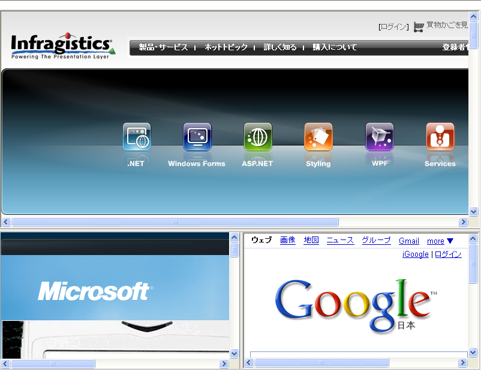

////

|metadata|
{
    "name": "websplitter-nesting-the-splitter-bars-inside-panes",
    "controlName": ["WebSplitter"],
    "tags": ["How Do I"],
    "guid": "{BB42A859-57A1-4863-B177-2F9831847206}",  
    "buildFlags": [],
    "createdOn": "0001-01-01T00:00:00Z"
}
|metadata|
////

= ペイン内に分割バーをネスト

== 始める前に

WebSplitter™ ペインをネストしたユーザー インタフェースを作成するために、コンテンツ テンプレートのいずれかの中に WebSplitter がもうひとつある親の WebSplitter を作成する必要があります。

*以下の手順の前提は以下のとおりです。*

* ブランクの WebForm で新しい ASP.NET AJAX 対応の Web サイトをすでに作成している。
* WebForm 上に ASP.NET AJAX ScriptManager インスタンスがある。
* このアプリケーションで Infragistics Application Styling を有効にしており、Default Style を使用している。

== 達成すること

読み終わると、ネストされた WebSplitter ペインを実行サンプルで作成することが可能となります。

== 次の手順を実行します。

[start=1]
. Visual Studio Toolbox で、WebSplitter コントロールを指定してダブルクリックします。これは WebForm にインスタンスを配置します。
[start=2]
. WebSplitter コントロールをクリックして、[プロパティ] ウィンドウで Height プロパティを指定して 600px に設定します。
[start=3]
. Width のプロパティを指定して 800px に設定します。
[start=4]
. pick:[asp-net="link:{ApiPlatform}web{ApiVersion}~infragistics.web.ui.layoutcontrols.websplitter~panes.html[Panes]"]  プロパティを指定して、次に省略記号（...）ボタンをクリックして、SplitterPane コレクション エディタを開きます。
[start=5]
. 2 つの個別の  pick:[asp-net="link:{ApiPlatform}web{ApiVersion}~infragistics.web.ui.layoutcontrols.splitterpane.html[SplitterPanes]"]  を追加するには [追加] ボタンを 2 回クリックします。
[start=6]
. 最初の SplitterPane をクリックし、[プロパティ] ウィンドウで  pick:[asp-net="link:{ApiPlatform}web{ApiVersion}~infragistics.web.ui.layoutcontrols.contentpane~contenturl.html[ContentUrl]"]  プロパティを指定し、その値を http://jp.infragistics.com に設定します。
[start=7]
. [OK] ボタンをクリックして SplitterPane コレクション エディタを閉じます。
[start=8]
. 次に一本の線を HTML Markup に追加します。Default.aspx で、[ソース] ボタンをクリックして、マークアップ ビューを表示します。
[start=9]
. WebSplitter 要素を指定して Panes 要素を指定します。これは、作成した 2 つの SplitterPanes を含みます。
[start=10]
. 2 番目の SplitterPane の間に、 pick:[asp-net="link:{ApiPlatform}web{ApiVersion}~infragistics.web.ui.layoutcontrols.contentpane~template.html[Template]"]  要素を挿入します。コードは以下のように表示されるはずです。

*HTML の場合:*

----
<igweb:WebSplitter ID="WebSplitter1" runat="server" 
  Height="600px" Width="800px">
	<Panes>
		<igweb:SplitterPane runat="server" ContentUrl="http://jp.infragistics.com">
		</igweb:SplitterPane>
		<igweb:SplitterPane runat="server">
			<Template/>
		</igweb:SplitterPane>
	</Panes>
</igweb:WebSplitter>
----

[start=11]
. [デザイン] ボタンをクリックしてデザイン モードに戻ります。
[start=12]
. 一番下の SplitterPane をクリックして、入力フォーカスをここに置きます。
[start=13]
. Visual Studio Toolbox に戻り、2 番目の SplitterPane のコンテンツ テンプレートに WebSplitter コントロールをもうひとつ追加するには WebSplitter をクリックします。
[start=14]
. 次に一番下にある SplitterPaneにある新しい WebSplitter コントロールをクリックして、[プロパティ] ウィンドウで、Height プロパティと Width プロパティ内に含まれている値を削除します。これによって、SplitterPanes はその中に含まれているコンテンツのサイズにしたがって SplitterPanes 自体をリサイズします。
[start=15]
.  pick:[asp-net="link:{ApiPlatform}web{ApiVersion}~infragistics.web.ui.layoutcontrols.websplitter~orientation.html[Orientation]"]  プロパティを指定して Vertical に設定します。
[start=16]
. 二番目の WebSplitter の Panes コレクションを指定して、省略記号ボタン（...）をクリックして SplitterPane コレクション エディタを起動します。
[start=17]
. 2 つの SplitterPane を追加するには [追加] ボタンを 2 回クリックします。
[start=18]
. 最初の SplitterPane をクリックして、[プロパティ] ウィンドウで、ContentUrl プロパティを http://www.microsoft.com に設定します。
[start=19]
. 2 番目の SplitterPane をクリックして、[プロパティ] ウィンドウで、ContentUrl プロパティを http://www.google.com に設定します。
[start=20]
. [OK] ボタンをクリックして SplitterPane コレクション エディタを閉じます。
[start=21]
. アプリケーションを保存して実行します。アプリケーションは以下の画像のようになるはずです。

一番上の SplitterPane は Infragistics™ Web サイトにリンクされ、一番下の SplitterPane にはもうひとつの WebSplitter コントロールが含まれています。ネストされた WebSplitter 内の 2 つの SplitterPanes にも 2 つの SplitterPanes が含まれています。ひとつは Microsoft™ の Web サイトにリンクされ、もうひとつは Google™ の Web サイトにリンクされます。親の WebSplitter の Orientation が直接の子の WebSplitter と同じでないようにネストされた WebSplitter の方向を変えるのが賢明です。子の WebSplitter コントロールの方向を変更したくない場合には、必要でない場合に余分のコントロールを持つというオーバーヘッドを負わないように子の WebSplitter の追加もスキップして、より多くの SplitterPane を追加することができます。