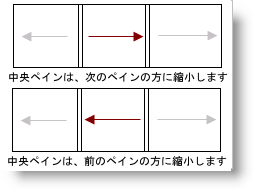
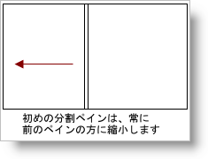
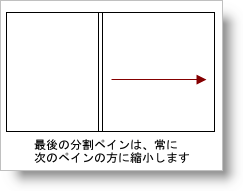
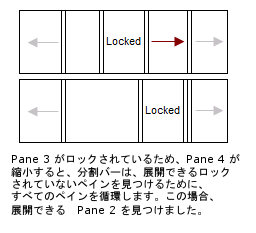

////

|metadata|
{
    "name": "websplitter-pane-collapsing",
    "controlName": ["WebSplitter"],
    "tags": ["How Do I"],
    "guid": "{A75F3692-7243-4A21-B3BA-61C88719842B}",  
    "buildFlags": [],
    "createdOn": "0001-01-01T00:00:00Z"
}
|metadata|
////

= ペインの縮小

WebSplitter™ はペインを縮小し、これによって、ペインのコンテンツを非表示にしてペインが使用していた領域を開放します。デフォルトで、すべてのペインが縮小可能とは限りませんが、分割バーを変わらずに表示します。ペインを縮小可能な時には、縮小アイコンが分割バーに表示します。ユーザーは縮小アイコンを使用してペインを縮小します。

Pane の  pick:[asp-net="link:{ApiPlatform}web{ApiVersion}~infragistics.web.ui.layoutcontrols.splitterpane~collapseddirection.html[CollapseDirection]"]  プロパティを設定することによって、ペインの縮小方向を定義できます。ペインは次のペインの方に縮小する、または前のペインの方に縮小します。

== 縮小規則における例外

* コレクションの最初のペインは常に前のペインの方に縮小します。

* コレクションの最後のペインは常に次のペインの方に縮小します。

== 解放されたスペースはどうなるのか

WebSplitter でペインを縮小すると、隣接するペインを自動的に展開することで領域を開放します。

image::images/WebSplitter_How_Panes_Collapse_04.png[]

すぐ隣のペインがロックされると、WebSplitter は広げることができるロックされていないペインを見つけるまで  pick:[asp-net="link:{ApiPlatform}web{ApiVersion}~infragistics.web.ui.layoutcontrols.websplitter~panes.html[Panes]"]  コレクションを反復します。

