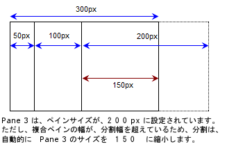
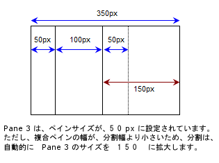
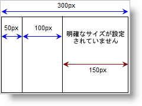
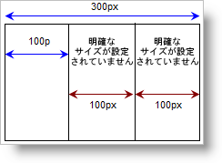

////

|metadata|
{
    "name": "websplitter-pane-resizing",
    "controlName": ["WebSplitter"],
    "tags": ["How Do I"],
    "guid": "{CE843FF4-F185-47F2-9EED-5D248257C56E}",  
    "buildFlags": [],
    "createdOn": "0001-01-01T00:00:00Z"
}
|metadata|
////

= ペインのリサイズ

WebSplitter™ ペインのサイズを手動で定義する、または WebSplitter がペインのサイズを指定するようにすることができます。

== 一般的なペインのサイズ指定に関する質問:

*  pick:[asp-net="link:{ApiPlatform}web{ApiVersion}~infragistics.web.ui.layoutcontrols.websplitter~orientation.html[Orientation]"]  プロパティが Horizontal の場合、すべてのペインの幅の合計がコントロールの設定された幅よりも広い場合にはペインはどのようにリサイズするのでしょうか?反対に、Orientation プロパティが Vertical に設定される場合、すべてのペインの高さの合計がコントロールの設定された高さよりも高い場合にはペインはどのようにリサイズするのでしょうか?
* ペインの幅の合計がコントロールの定義された幅よりも狭い場合にはペインはどのようにリサイズするのでしょうか?ペインの高さの合計がコントロールの定義された高さよりも低い場合にはペインはどのようにリサイズするのでしょうか?
* 単一のペインで幅または高さを設定しない場合、その他のサイズが設定された時にペイン自体がどのようにサイズ設定されるのでしょうか?
* ペインで幅または高さを設定しない場合、ペイン自体はどのようにサイズ設定されるのでしょうか?
* WebSplitter のサイズを設定しない場合、ペイン自体はどのようにサイズ設定されるのでしょうか?

以下のセクションは上記の質問に対する答えを提供します。

== 合計のペイン サイズがコントロールのサイズよりも大きい

WebSplitter の Orientation が Horizontal に設定され、コントロールの幅を設定した場合、すべてのペインはコントロールの幅によって制限されます。反対に、WebSplitter の Orientation プロパティが Vertical に設定され、コントロールの高さも設定した場合、すべてのペインは高さによって制限されます。すべてのペインの合計の幅または高さがコントロールの幅または高さよりも大きい場合には、WebSplitter は許可された領域に収まるまで  pick:[asp-net="link:{ApiPlatform}web{ApiVersion}~infragistics.web.ui.layoutcontrols.websplitter~panes.html[Panes]"]  コレクションの最後のペインのサイズを小さくします。

== 合計のペイン サイズがコントロールのサイズよりも小さい

WebSplitter の Orientation プロパティが Horizontal に設定され、すべてのペインの合計の幅がコントロールの幅より狭い場合には、WebSplitter は残りの領域を埋めるために最後のペインの幅を自動的に拡大します。WebSplitter の Orientation プロパティが Vertical に設定され、すべてのペインの合計の高さがコントロールの幅より高い場合には、WebSplitter は残りの領域を埋めるために最後のペインの高さを自動的に拡大します。

== 単一のペインにサイズが設定されていない

単一のペインのサイズが未定義の場合、使用可能なすべての領域を自動的に使用します。

== 複数のペインでサイズが設定されていない

複数のペインのサイズが未定義の場合、WebSplitter はそれぞれのサイズが設定されていないペイン間で使用可能な領域を均等に分割します。

== WebSplitter のサイズが未定義

WebSplitter のサイズが未定義の場合、Panes コレクション内のすべてのペインの合計のサイズに自動的に設定します。