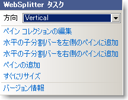

////

|metadata|
{
    "name": "websplitter-websplitter-smart-tag",
    "controlName": ["WebSplitter"],
    "tags": ["How Do I"],
    "guid": "{47B09561-B831-46D9-9F05-106A2BCB2EC2}",  
    "buildFlags": [],
    "createdOn": "0001-01-01T00:00:00Z"
}
|metadata|
////

= WebSplitter スマート タグ

Visual Studio 2005/2008（.NET Framework 2.0/3.5）では、{ProductName} の個々のコントロール/コンポーネントにはスマート タグがあります。コントロールやコンポーネントを選択するだけで、スマート タグのアンカーが表示されます。このアンカーをクリックするとポップアップ パネルが表示され、そこからコントロール/コンポーネントの最もよく使うプロパティや設定にすばやく簡単にアクセスできます。

WebSplitter™ のスマート タグには次のリンクが含まれています。

* ペインの編集コレクション -- これを選択すると WebSplitter クイック デザイナを開きます。これによって、ペインを追加する、または既存のペインを編集することができます。
* 水平分割バー --  これを選択することによって、分割バーの方向を水平から垂直に切り替えることができます。
* 水平の子分割バーを左側のペインに追加 -- これを選択すると、WebSplitter の左側のペインに水平の子分割バーが追加されます。
* 水平の子分割バーを右側のペインに追加 -- これを選択すると、WebSplitter の右側のペインに水平の子分割バーが追加されます。
* ペインの追加 -- これを選択すると、WebSplitter の右に新しいペインを追加します。
* すぐにリサイズ --
* バージョン情報 -- これを選択すると WebSplitter の製品情報を開きます。ステータス、バージョン、有効期限、製品キーなどの情報が含まれます。

