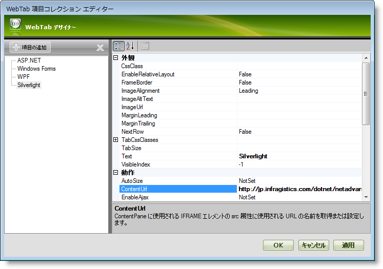

////

|metadata|
{
    "name": "webtab-getting-started-with-webtab",
    "controlName": ["WebTab"],
    "tags": ["How Do I"],
    "guid": "{A8FC4BFA-3826-43E7-8DEF-E6AF4DB826C2}",  
    "buildFlags": [],
    "createdOn": "0001-01-01T00:00:00Z"
}
|metadata|
////

= WebTabで開始

WebTab™ によってリッチなユーザー インターフェイス デザイナーを使用してタブを手動で追加できます。外観、動作およびさまざまなその他のプロパティを設定する WebTab デザイナーを使用して各タブ項目をカスタマイズできます。

=== デザイナーを使用してタブを WebTab に追加するには、次の手順に従ってください。

[start=1]
. Visual Studio™ ツールボックスから、ScriptManager コンポーネントと WebTab コントロールを WebForm にドラッグ アンド ドロップします。
[start=2]
. [プロパティ] ウィンドウで、WebTab コントロールの Tabs プロパティを指定して、省略記号（...）ボタンをクリックして WebTab デザイナーを起動します。WebTab スマートタグで [タブの編集] をクリックすることによってデザイナーを起動することもできます。
[start=3]
. [WebTab の編集] ダイアログで、[項目を追加] ボタンをクリックします。これによって新しいタブをタブ コレクションに追加します。以下のプロパティを設定します。

[options="header", cols="a,a"]
|====
|Text|ContentUrl

|ASP.NET
|http://jp.infragistics.com/dotnet/netadvantage/aspnet.aspx#Overview

|====

*注：*  pick:[asp-net="link:{ApiPlatform}web{ApiVersion}~infragistics.web.ui.layoutcontrols.contentpane~contenturl.html[ContentUrl]"]  プロパティは  pick:[asp-net="link:{ApiPlatform}web{ApiVersion}~infragistics.web.ui.layoutcontrols.contentpane~usercontrolurl.html[UserControlUrl]"]  プロパティとテンプレート（明示的な子コントロール）に優先します。これはコンテンツ url が設定される場合、ユーザー コントロールとテンプレートが無視され描画されないことを意味します。また、UserControlUrl プロパティが設定される場合、ユーザー コントロールはクライアントでテンプレートして自身を描画し、既存のテンプレートを置き換えます。

[start=4]
. 繰り返して以下のタブを追加します。

[options="header", cols="a,a"]
|====
|Text|ContentUrl

|Windows Forms
|http://jp.infragistics.com/dotnet/netadvantage/winforms.aspx#Overview

|WPF
|http://jp.infragistics.com/dotnet/netadvantage/wpf.aspx#Overview

|Silverlight
|http://jp.infragistics.com/dotnet/netadvantage/silverlight/line-of-business.aspx#Overview

|====

[start=5]
. この時点で、[WebTab の編集] ダイアログは次のように表示されます。

[start=6]
. [適用] と [OK] をクリックして WebTab デザイナーを閉じます。
[start=7]
. アプリケーションを保存して実行します。WebTab は以下の画像のようになるはずです。 

image::images/WebTab_Adding_Tabs_to_the_WebTab_02.png[]

*注：* javascript エラーが表示されたら、 pick:[asp-net="link:{ApiPlatform}web{ApiVersion}~infragistics.web.ui.layoutcontrols.tabpostbackoptions~enableloadondemandurl.html[EnableLoadOnDemandUrl]"]  プロパティを True に設定することを推奨します。ただし、このプロパティは、それぞれのタブが選択されるまで ContentUrl をロードできないようにします。詳細は、 link:webtab-using-load-on-demand-for-tabs-with-content-url-set.html[コンテンツ Url を設定してタブにロードオンデマンドを使用]を参照してください。

=== タブをプログラムで追加:

上記の手順は以下のコードで実行することも可能です。

*HTML の場合:*
[source]

----
        <ig:WebTab ID="WebTab1" runat="server" Height="165px" Width="631px">
          <tabs>
            <ig:ContentTabItem runat="server" 
                ContentUrl="http://jp.infragistics.com/dotnet/netadvantage/aspnet.aspx#Overview" 
                Text="ASP.NET">
            </ig:ContentTabItem>
            <ig:ContentTabItem runat="server" 
                ContentUrl="http://jp.infragistics.com/dotnet/netadvantage/winforms.aspx#Overview" 
                Text="Windows Forms">
            </ig:ContentTabItem>
            <ig:ContentTabItem runat="server" 
                ContentUrl="http://jp.infragistics.com/dotnet/netadvantage/wpf.aspx#Overview" 
                Text="WPF">
            </ig:ContentTabItem>
            <ig:ContentTabItem runat="server" 
                ContentUrl="http://jp.infragistics.com/dotnet/netadvantage/silverlight/line-of-business.aspx#Overview" 
                Text="Silverlight">
            </ig:ContentTabItem>
           </tabs>
        </ig:WebTab>
----
*Visual Basic の場合：*
[source,docX-root]

----
        Dim Tab1 As New ContentTabItem() 
        Tab1.Text = "ASP.NET" 
        Tab1.ContentUrl = "http://jp.infragistics.com/dotnet/netadvantage/aspnet.aspx#Overview" 
        Dim Tab2 As New ContentTabItem() 
        Tab2.Text = "Windows Forms" 
        Tab2.ContentUrl = "http://jp.infragistics.com/dotnet/netadvantage/winforms.aspx#Overview" 
        Dim Tab3 As New ContentTabItem() 
        Tab3.Text = "WPF" 
        Tab3.ContentUrl = "http://jp.infragistics.com/dotnet/netadvantage/wpf.aspx#Overview" 
        Dim Tab4 As New ContentTabItem() 
        Tab4.Text = "Silverlight" 
        Tab4.ContentUrl = "http://jp.infragistics.com/dotnet/netadvantage/silverlight/line-of-business.aspx#Overview" 
        WebTab1.Tabs.Add(Tab1) 
        WebTab1.Tabs.Add(Tab2) 
        WebTab1.Tabs.Add(Tab3) 
        WebTab1.Tabs.Add(Tab4)

----
*C# の場合：*
[source,docX-root]

----

----
        ContentTabItem Tab1 = new ContentTabItem();
        Tab1.Text = "ASP.NET";
        Tab1.ContentUrl = "http://jp.infragistics.com/dotnet/netadvantage/aspnet.aspx#Overview";
        ContentTabItem Tab2 = new ContentTabItem();
        Tab2.Text = "Windows Forms";
        Tab2.ContentUrl = "http://jp.infragistics.com/dotnet/netadvantage/winforms.aspx#Overview";
        ContentTabItem Tab3 = new ContentTabItem();
        Tab3.Text = "WPF";
        Tab3.ContentUrl = "http://jp.infragistics.com/dotnet/netadvantage/wpf.aspx#Overview";
        ContentTabItem Tab4 = new ContentTabItem();
        Tab4.Text = "Silverlight";
        Tab4.ContentUrl = "http://jp.infragistics.com/dotnet/netadvantage/silverlight/line-of-business.aspx#Overview";
        WebTab1.Tabs.Add(Tab1);
        WebTab1.Tabs.Add(Tab2);
        WebTab1.Tabs.Add(Tab3);
        WebTab1.Tabs.Add(Tab4);
----

== 関連トピック

link:webtab-keyboard-navigation.html[キーボード ナビゲーション]

link:webtab-using-webtab.html[WebTab の使用]