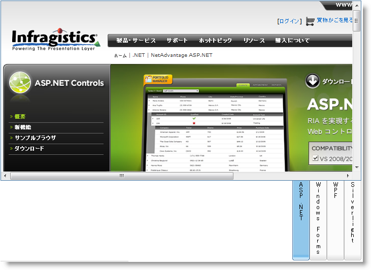

////

|metadata|
{
    "name": "webtab-orientation-and-alignment",
    "controlName": ["WebTab"],
    "tags": ["How Do I","Performance"],
    "guid": "{9B95C0A9-7B77-41CA-8092-6927F9222F2F}",  
    "buildFlags": [],
    "createdOn": "0001-01-01T00:00:00Z"
}
|metadata|
////

= 方向と配置

WebTab™ は、さまざまな方向とタブの配置をサポートします。タブは、 pick:[asp-net="link:{ApiPlatform}web{ApiVersion}~infragistics.web.ui.layoutcontrols.webtab~taborientation.html[TabOrientation]"]  プロパティを Horizontal または Vertical に設定して水平または垂直に配置することができます。タブは、コントロールの  pick:[asp-net="link:{ApiPlatform}web{ApiVersion}~infragistics.web.ui.layoutcontrols.webtab~tablocation.html[TabLocation]"]  プロパティを  pick:[asp-net="link:{ApiPlatform}web{ApiVersion}~infragistics.web.ui.layoutcontrols.tablocation.html[TabLocation]"]  列挙型のメンバーに設定してコンテンツペインを 8 方向へ設定できます。

*HTML の場合:*

----
<ig:WebTab ID="WebTab1" runat="server"  
        TabOrientation="Vertical" TabLocation="BottomRight" >
 …               
</ig:WebTab>
----

*Visual Basic の場合：*

----
WebTab1.TabOrientation = Orientation.Vertical
WebTab1.TabLocation = TabLocation.BottomRight
----

*C# の場合：*

----
WebTab1.TabOrientation = Orientation.Vertical;
WebTab1.TabLocation = TabLocation.BottomRight;
----

== 関連トピック

link:webtab-about-webtab.html[WebTabの理解]

link:webtab-getting-started-with-webtab.html[WebTabで開始]

link:webtab-header-and-content-panes.html[ヘッダー ペイントとコンテンツ ペイン]

link:webtab-tab-states.html[タブの状態]

link:webtab-ajax-indicator-support-for-webtab.html[WebTab の Ajax インジケーターのサポート]

link:webtab-display-modes.html[表示モード]

link:webtab-animations.html[アニメーション]

link:webtab-handling-overflow-in-webtab.html[WebTab でオーバーフローを処理]

link:webtab-load-on-demand.html[ロードオンデマンド]

link:webtab-overlapping-tabs.html[タブの重複]

link:webtab-tab-moving.html[タブの移動]

link:webtab-scrolling.html[スクロール]

link:webtab-validation-in-webtab.html[WebTab で検証]

link:webtab-api-overview.html[API の概要]

link:webtab-client-side-object-model.html[クライアント サイド オブジェクト モデル（CSOM）の概要]