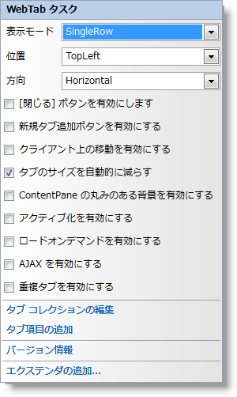

////

|metadata|
{
    "name": "webtab-webtab-smart-tag",
    "controlName": ["WebTab"],
    "tags": ["How Do I"],
    "guid": "{58213E55-5D49-451C-989B-2B28C1A3FB73}",  
    "buildFlags": [],
    "createdOn": "0001-01-01T00:00:00Z"
}
|metadata|
////

= WebTab スマートタグ

Visual Studio 2005/2008（.NET Framework 2.0/3.5）では、{ProductName} の個々のコントロール/コンポーネントにはスマートタグがあります。コントロールやコンポーネントを選択することで、スマートタグのアンカーが表示されます。このアンカーをクリックするとポップアップ パネルが表示され、そこからコントロール/コンポーネントの最もよく使うプロパティや設定にすばやく簡単にアクセスできます。

*WebTab™ のスマートタグには次の項目が含まれています。*

* 表示モード – 単一行またはスクロール可能な単一行、または複数行などのタブの表示モードを設定できます。
* 位置 – コンテンツ ペインに相対してタブの位置を設定できます。
* 方向 – タブのテキストおよび画像を水平方向または垂直方向に設定できます。
* 閉じるボタンを有効 – タブで閉じるボタンを有効にできます。
* 新しいタブを追加ボタンを有効 – 新しいタブを追加するためのボタンを有効にできます。
* クライアントで移動を有効 – エンドユーザーはタブを移動できます。
* タブのサイズを自動縮小 – すべてのタブがコントロールのサイズ収まりきらない場合、タブのサイズを縮小できます。

*注：* このプロパティは、タブで幅を設定し  pick:[asp-net="link:{ApiPlatform}web{ApiVersion}~infragistics.web.ui.layoutcontrols.webtab~taborientation.html[TabOrientation]"]  が水平方向で  pick:[asp-net="link:{ApiPlatform}web{ApiVersion}~infragistics.web.ui.layoutcontrols.webtab~displaymode.html[DisplayMode]"]  が単一行または複数行である場合に限って有効です。

* ContentPane を丸みのある背景にする – 丸みのある背景で WebTab のコンテンツ ペインを表示できます。
* アクティブ化を有効 – アクティブなタブを変更して選択するためにフォーカスを設定し、キーに応答できます。
* ロードオンデマンドを有効 – WebTab でロードオンデマンドを有効にできます。
* Ajax を有効 – WebTab の非同期ポストバックを有効にできます。

*注：* 非同期機能は、タブのコンテンツを UpdatePanels にラップすることで達成できます。

* タブのオーバーラップを有効 – タブ ヘッダーが同時タブ ヘッダーと重複するようにできます。

*WebTab のスマートタグには次のリンクが含まれています。*

* タブの編集 - タブの追加または削除およびプロパティの設定のために [WebTab の編集] ダイアログを表示します。
* タブ項目の追加 – 新しいタブをタブ コレクションに追加します。
* バージョン情報 -- これをクリックすると WebTab 製品の情報を開きます。状態、バージョン、有効期限、製品キーなどの情報を含みます。
* エクステンダーの追加 -- これをクリックすると、WebTab と使用可能なすべてのコントロール エクステンダーを表示するダイアログを表示します。

*項目の説明と、プロパティ グリッドの各項目が対応するプロパティについては、以下の表を参照してください。*

[options="header", cols="a,a,a"]
|====
|項目|説明|対応するプロパティ

|表示モード
|WebTab の表示モードを設定します。
|*DisplayMode*

|位置
|コンテンツ ペインに相対してタブの位置を設定します。
|*TabLocation*

|方向
|タブのテキストおよび画像の水平方向または垂直方向を設定します。
|*TabOrientation*

|閉じるボタンを有効
|タブの閉じるボタンを表示または非表示にします。
|*CloseButton.Enabled*

|新しいタブを追加ボタンを有効
|クライアントで新しいタブ項目を追加することを許可するボタン項目の表示/非表示を設定します。
|*AddNewTabItem.Enabled*

|クライアントで移動を有効
|マウス ドラッグでタブ項目を移動する機能を設定します。
|*TabMoving.Enabled*

|タブのサイズを自動縮小
|サイズ全体がコントロールのサイズに収まらない場合、タブのサイズを縮小するためのオプションを設定します。
|*TabsOverflow*

|ContentPane を丸みのある背景にする
|コンテンツ ペインで丸みのある背景を描画するためのオプションを設定します。
|*ContentPane.RoundedBackground.Enabled*

|====