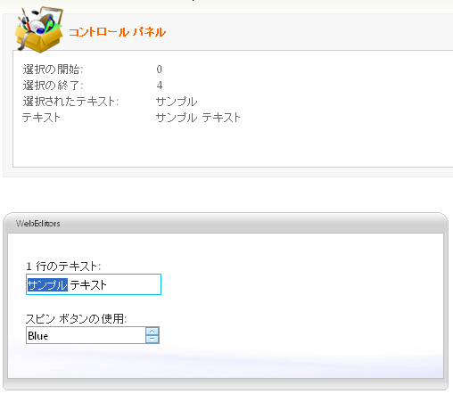

////

|metadata|
{
    "name": "webtexteditor-about-webtexteditor",
    "controlName": ["WebTextEditor"],
    "tags": ["Editing","Getting Started"],
    "guid": "{69A10705-3E8D-4E4E-AEB9-62D43DA98DA7}",  
    "buildFlags": [],
    "createdOn": "0001-01-01T00:00:00Z"
}
|metadata|
////

= WebTextEditor について

WebTextEditor™ は、1 行のテキストまたは複数行のテキストを編集できるエディター コントロールで、さまざまな外観および動作ベースのプロパティを提供します。WebTextEditor は優れたパフォーマンスと応答性の高いエンドユーザー エクスペリエンスを促進する証明済みのコードベースを利用するために {ProductName} AJAX フレームワークを使用して構築されます。 pick:[asp-net="link:{ApiPlatform}web{ApiVersion}~infragistics.web.ui.editorcontrols_namespace.html[Infragistics.Web.UI.EditorControls]"]  名前空間で WebTextEditor を見つけることができます。

すべての {ProductName} AJAX コントロールのように、WebTextEditor は Infragistics® Application Styling Framework にシームレスに統合します。CSS ベースのプロパティを使用すると、既存のスタイル シートを利用することによって、WebTextEditor を手動でカスタマイズできます。

WebTextEditor は、クライアント側の JavaScript プログラミング環境に堅牢なモデルも公開します。クライアント サイド オブジェクトモデル（CSOM）は、十分な機能を備えたプロパティとメソッドで構成され、開発者はサーバー側でポストバックしなくても、重要な機能単位をプログラムできます。

WebTextEditor コントロールの機能の一部には以下が含まれます:

* *ハイパフォーマンス* -- 軽量のマークアップと最適化されたコードがパフォーマンスを向上します。
* *複数行テキスト* -- ディスプレイで複数行テキストを編集できます。
* *スピン ボタン* -- スピン ボタンを使用して値のリストを簡単にスピンできます。
* *CustomButtonHotKeys* -- ホット キーを使用してカスタム ボタン クリックを起動することができます。
* *パスワード モード* -- 単一プロパティを設定することにより入力文字をマスクします。
* *標準的なバリデーターのサポート* -- ASP.NET バリデーター コントロールをサポートします。
* *MaxLength* -- コントロールに入力できるテキスト文字列の最大長を設定できます。
* *SelectionOnFocus* -- 編集モードに入ると必ず異なる選択タイプを設定できます。