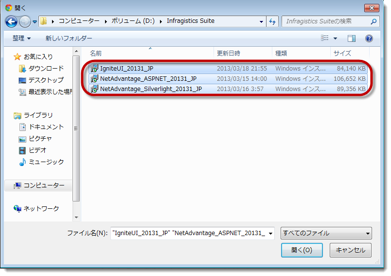
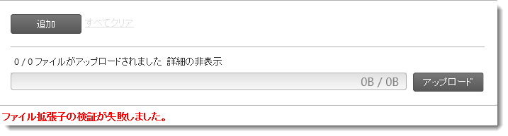
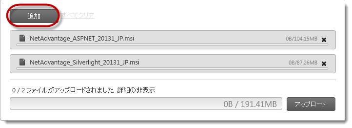
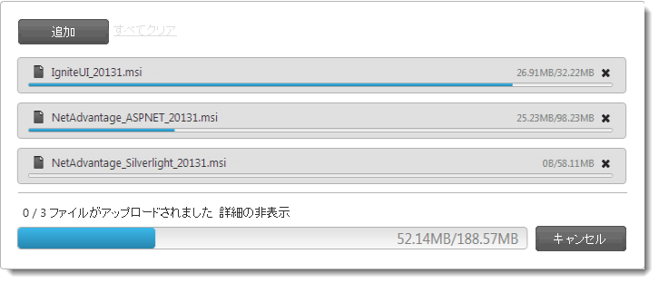
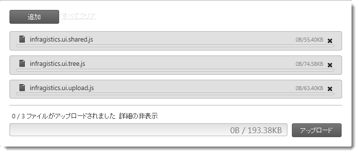

////
|metadata|
{
    "name": "webupload-configuring-webupload",
    "controlName": ["WebUpload"],
    "tags": [],
    "guid": "0c592204-e37b-4de0-8578-3ada0d792288","buildFlags": [],
    "createdOn": "2013-03-21T12:06:23.9727899Z"
}
|metadata|
////

= WebUpload アップロード

== トピックの概要

=== 目的

このトピックは、コード例を示して、 _WebUpload_™ コントロールを構成する方法を説明します。

=== 前提条件

このトピックを理解するためには、以下のトピックを理解しておく必要があります。

[options="header", cols="a,a"]
|====

|トピック|目的 

| link:webupload-overview.html[WebUpload 概要] 

|このトピックは _WebUpload_ コントロールおよびその機能について紹介します。このトピックでは、コントロールを ASPX ページに追加する方法について説明します。 

| link:webupload-http-module-and-handler.html[HTTP ハンドラーとモジュールの使用] 

|このトピックは、HTTP モジュールおよび HTTP ハンドラーを構成し、 _WebUpload_ コントロールでアップロードされたデータを受け入れるサーバー イベントを処理する方法を示します。 

|==== 

=== 外部リソース
link:http://www.w3.org/TR/html-markup/input.file.html#input.file[HTML: マークアップ言語 (HTML 言語参照) ] 

=== このトピックの内容

このトピックは、以下のセクションで構成されます。

* <<_Ref350640800, _WebUpload_   構成の概要>>

** <<_Ref350640814, _WebUpload_   構成の要約>>
** <<_Ref348004504, _WebUpload_   構成の概要図>>

* <<_Ref350640827,ファイル選択モードの構成 (単一/複数)>>

** <<_Ref341791598,概要>>
** <<_Ref350629718,要件>>
** <<_Ref341791602,プロパティ設定>>
** <<_Ref341791605,例>>

* <<_Ref348004537,アップロード トリガーの構成 (手動/自動)>>

** <<_Ref341791611,概要>>
** <<_Ref341791614,プロパティ設定>>
** <<_Ref341791617,例>>

* <<_Ref350640910,許可されるファイル タイプの構成>>

** <<_Ref341791623,概要>>
** <<_Ref341791628,プロパティ設定>>
** <<_Ref341791631,例>>

* <<_Ref334453966,アップロードするファイルの最大数を構成>>

** <<_Ref348004568,概要>>
** <<_Ref348004571,プロパティ設定>>
** <<_Ref348004575,例>>

* <<_Ref350640978,同時にアップロードするファイルの最大数の構成>>

** <<_Ref348004582,概要>>
** <<_Ref348004585,プロパティ設定>>
** <<_Ref348004588,例>>

* <<_Ref350641009,ファイル表示モードの構成>>

** <<_Ref341791587,概要>>
** <<_Ref341791589,プロパティ設定>>
** <<_Ref341791592,例>>

* <<_Ref350641041,関連コンテンツ>>

** <<_Ref341791637,トピック>>
** <<_Ref341791642,サンプル>>

[[_Ref350640800]]
== _WebUpload_   構成の概要

[[_Ref350640814]]

=== WebUpload 構成の要約

_WebUpload_   コントロールは、多数のカスタマイズ オプションがあります。使用できるファイル タイプを制御、同時にアップロードするファイル数の指定、ファイル パネルでユーザー操作を構成できます (アップロード可能なファイル数と  _WebUpload_    __パネル__  の表示)。また、アップロードが自動的に開始するか明示的なユーザー操作によって開始するかを選択します詳細については、<<_Ref348004504,WebUpload 構成概要図>> とそれに続くセクションをご参照ください。

[[_Ref348004504]]

=== WebUpload 構成の概要図

以下の表は、 _WebUpload_   で構成可能な機能を示します。このメソッドについては、表の下にある解説もご参照ください。

[options="header", cols="a,a,a"]
|====
|構成可能な要素|詳細|プロパティ

|<<_Ref350640827,ファイル選択モード (単一/複数)>>
|ユーザーによるファイル選択が可能かどうか、いつファイルを選択するか、また一度に複数のファイルを選択できるかどうかを構成できます。
|
* link:{ApiPlatform}web.jquery{ApiVersion}~infragistics.web.ui.editorcontrols.webupload~mode.html[Mode] 

* link:{ApiPlatform}web.jquery{ApiVersion}~infragistics.web.ui.editorcontrols.webupload~multiplefiles.html[MultipleFiles] 

|<<_Ref348004537,トリガーのアップロード (手動/自動)>>
|ユーザーが _WebUpload_ パネルにファイルを追加すると、アップロードが自動的に開始または手動で開始 (ユーザーの Upload ボタン押下によって) するかどうかを構成します。
|
* link:{ApiPlatform}web.jquery{ApiVersion}~infragistics.web.ui.editorcontrols.webupload~autostartupload.html[AutoStartUpload] 

|<<_Ref350640910,許可されるファイル タイプ>>
|ユーザーがアップロードできるファイルのタイプを構成できます。
|
* link:{ApiPlatform}web.jquery{ApiVersion}~infragistics.web.ui.editorcontrols.webupload~allowedextensions.html[AllowedExtensions] 

|<<_Ref350640937,アップロードするファイルの最大数>>
|ページの更新ごとにアップロードできる最大ファイル数を構成できます。
|
* link:{ApiPlatform}web.jquery{ApiVersion}~infragistics.web.ui.editorcontrols.webupload~maxuploadedfiles.html[MaxUploadedFiles] 

|<<_Ref350640978,同時にアップロードするファイルの最大数の構成>>
|この設定は、同時ファイル アップロード数のしきい値を構成します。
|
* link:{ApiPlatform}web.jquery{ApiVersion}~infragistics.web.ui.editorcontrols.webupload~maxsimultaneousfilesuploads.html[MaxSimultaneousFilesUploads] 

|<<_Ref350641009,ファイル表示モード>>
|_WebUpload_ コントロールのパネルに表示するファイル数を構成できます。
|
* link:{ApiPlatform}web.jquery{ApiVersion}~infragistics.web.ui.editorcontrols.webupload~mode.html[Mode] 

|====

[[_Ref350640827]]
== ファイル選択モードの構成 (単一/複数)

[[_Ref341791598]]

=== 概要

ユーザーによるファイル選択が可能かどうか、いつファイルを選択するか、また一度に複数のファイルを選択できるかどうかを構成できます。この機能は、 _WebUpload_   のファイル選択モードで管理されます。ファイル選択モードは、単一ファイル (ユーザーは 1 パスで 1 ファイル選択可能) または複数ファイル (ユーザーは 1 パスで複数ファイル選択可能) です。

ユーザーは複数ファイル選択モードで以下が可能です。

* ファイル Open ダイアログから複数ファイルを選択。
* ファイルを Windows® Explorer から _WebUpload_   コントロールへドラッグ アンド ドロップ

単一ファイル選択モードでは、Open ダイアログでユーザーが選択できるのは 1 ファイルのみで、ファイルのドラッグ アンド ドロップもできません。複数ファイルをアップロードしたい場合、 _WebUpload_   コントロール パネルでファイルを追加する操作を繰り返す必要があります。

以下の画像は、2 通りのファイルを選択する方法を示します。開く ダイアログから開く、あるいは Windows エクスプローラーから  _WebUpload_   コントロールパネルへドロップして複数のファイルを開きます。

[options="header", cols="a,a"]
|====
|ファイルを 開く ダイアログで複数のファイルの選択する|選択したファイル Windows エクスプローラーから  _WebUpload_   へをドロップします

|image::images/Configuring_WebUpload_1.png[]
|image::images/Configuring_WebUpload_2.png[]

|====

デフォルトのファイル選択モードは、単一ファイルです。

ファイル選択モードは、 link:{ApiPlatform}web.jquery{ApiVersion}~infragistics.web.ui.editorcontrols.webupload~mode.html[Mode] および link:{ApiPlatform}web.jquery{ApiVersion}~infragistics.web.ui.editorcontrols.webupload~multiplefiles.html[MultipleFiles] オプションによって管理されます。 link:{ApiPlatform}web.jquery{ApiVersion}~infragistics.web.ui.editorcontrols.webupload~mode.html[Mode]  が  _Multiple_   の場合のみ link:{ApiPlatform}web.jquery{ApiVersion}~infragistics.web.ui.editorcontrols.webupload~multiplefiles.html[MultipleFiles] を  _true_   に設定にする意味があります。 link:{ApiPlatform}web.jquery{ApiVersion}~infragistics.web.ui.editorcontrols.webupload~mode.html[Mode] が  _単一_   の場合、 link:{ApiPlatform}web.jquery{ApiVersion}~infragistics.web.ui.editorcontrols.webupload~multiplefiles.html[MultipleFiles]  は効果がありません。

ファイル選択モード機能は、`input` 要素の link:http://www.w3.org/TR/html-markup/input.file.html#input.file[HTML 5 複数属性] を採用します。これにより、機能がブラウザー依存となります。サポートされていないブラウザーが使用されると、機能のプロパティを設定しても効果はありません。つまり、ユーザーは、ファイルを開くダイアログまたは  _WebUpload_   コントロールへドラッグ アンド ドロップして複数のファイルを選択することはできません。サポートされるブラウザーの一覧は、<<_Ref350629718,要件>>をご覧ください。

[[_Ref350629718]]

=== 要件

以下は、ファイル選択タイプを構成するための要件です。

* `input` 要素の HTML 5 `multiple` 属性をサポートするブラウザー

この機能は以下のブラウザーでのみ使用できます。

[options="header", cols="a,a,a,a,a"]
|====
|Chrome|Firefox|Internet Explorer|Opera|Safari

|1.0 またはそれ以降
|3.6 またはそれ以降
|10 またはそれ以降
|10.62 またはそれ以降
|5 またはそれ以降

|====

[[_Ref341791602]]

=== プロパティ設定

以下の表では、各プロパティ設定の構成です。

[options="header", cols="a,a,a"]
|====
|目的:|使用するプロパティ:|設定値

|ファイル選択モードを複数ファイルに設定する
|
* link:{ApiPlatform}web.jquery{ApiVersion}~infragistics.web.ui.editorcontrols.webupload~mode.html[Mode] 

* link:{ApiPlatform}web.jquery{ApiVersion}~infragistics.web.ui.editorcontrols.webupload~multiplefiles.html[MultipleFiles] 

|
* _“Multiple”_ 

* _True_ 

|ファイル選択モードを Single ファイルに設定する
|
* link:{ApiPlatform}web.jquery{ApiVersion}~infragistics.web.ui.editorcontrols.webupload~mode.html[Mode] 

|
* _“Single”_ 

|====

[[_Ref341791605]]

=== 例

これは、以下の設定の結果として複数のファイル選択を有効にする方法の例です。

[options="header", cols="a,a"]
|====
|プロパティ|値

|Mode
| _"Multiple"_ 

|MultipleFiles
| _True_ 

|====

以下のコードはこの例を実装します。

*ASPX の場合:*

[source,html]
----
<ig:WebUpload ID="WebUpload1" runat="server" Mode="Multiple" MultipleFiles="True">
</ig:WebUpload>
----

[[_Ref348004537]]
== アップロード トリガーの構成 (手動/自動)

[[_Ref341791611]]

=== 概要

ユーザーが  _WebUpload_   パネルにファイルを追加すると、アップロードが自動的に開始または手動で開始 (ユーザーの Upload ボタン押下によって) するかどうかを構成します。 _WebUpload_   コントロールの機能は、アップロード トリガーと呼ばれます。アップロード トリガーは、ファイル アップロードの自動スタートを有効または無効にします。

デフォルト アップロード トリガーは手動です。

アップロード トリガーは、 _WebUpload_   コントロールの link:{ApiPlatform}web.jquery{ApiVersion}~infragistics.web.ui.editorcontrols.webupload~autostartupload.html[AutoStartUpload] オプションによって管理されます。

[[_Ref341791614]]

=== プロパティ設定

以下の表では、各プロパティ設定の構成です。

[options="header", cols="a,a,a"]
|====
|目的:|使用するプロパティ:|設定値

|自動アップロードを有効にする
| link:{ApiPlatform}web.jquery{ApiVersion}~infragistics.web.ui.editorcontrols.webupload~autostartupload.html[AutoStartUpload]
|_True_

|自動アップロードを無効にする
| link:{ApiPlatform}web.jquery{ApiVersion}~infragistics.web.ui.editorcontrols.webupload~autostartupload.html[AutoStartUpload]
| _False_ 

|====

[[_Ref341791617]]

=== 例

これは、以下の設定の結果として自動アップロードを有効にする方法の例です。

[options="header", cols="a,a"]
|====
|プロパティ|値

| link:{ApiPlatform}web.jquery{ApiVersion}~infragistics.web.ui.editorcontrols.webupload~autostartupload.html[AutoStartUpload]
|_True_

|====

以下のコードはこの例を実装します。

*ASPX の場合:*

[source,html]
----
<ig:WebUpload ID="WebUpload1" runat="server" AutoStartUpload="True">
</ig:WebUpload>
----

[[_Ref350640910]]
== 許可されるファイル タイプの構成

[[_Ref341791623]]

=== 概要

ユーザーがアップロードできるファイルのタイプを構成できます。この機能は、許容されるファイル タイプの一覧で使用可能なファイル タイプのファイル名拡張子を明示的にリストして処理されます。このリストは、 link:{ApiPlatform}web.jquery{ApiVersion}~infragistics.web.ui.editorcontrols.webupload~allowedextensions.html[AllowedExtensions] プロパティの値として使用可能なファイル拡張子を表す `FileUploadExtension` オブジェクトのコレクションです。

デフォルトですべてのファイル タイプが更新できます。

ファイル拡張子の検証は、選択されたファイル拡張子を `AllowedExtenstions` プロパティで宣言された拡張子の一覧と比較します。拡張子の検証が失敗すると、 _WebUpload_   の  _onError_   イベントが発生します。 _onError_   ハンドラーの 2 つ目のパラメーターは、プロパティ `errorCode` `= 2` および `errorMessage` `= “ファイル拡張子の検証に失敗しました。”` のあるオブジェクトを含みます。ユーザーに表示するエラーはカスタマイズ可能です。

[[_Ref341791628]]

=== プロパティ設定

以下の表では、各プロパティ設定の構成です。

[options="header", cols="a,a,a"]
|====
|目的:|使用するプロパティ:|設定値

|許可する拡張子を定義します。
| link:{ApiPlatform}web.jquery{ApiVersion}~infragistics.web.ui.editorcontrols.webupload~allowedextensions.html[AllowedExtensions]
|`FileUploadExtension` オブジェクトのコレクション。

|====

[[_Ref341791631]]

=== 例

この例は、.xls および .doc ファイルのアップロードを許可するユーザーを設定する方法を示します。

[options="header", cols="a,a"]
|====
|プロパティ|値

| link:{ApiPlatform}web.jquery{ApiVersion}~infragistics.web.ui.editorcontrols.webupload~allowedextensions.html[AllowedExtensions]
|`FileUploadExtension` オブジェクトのコレクション。

|====

以下のコードはこの例を実装します。

*ASPX の場合:*

[source,html]
----
<ig:WebUpload ID="WebUpload1" runat="server">
    <AllowedExtensions>
        <ig:FileUploadExtension Extension="doc" />
        <ig:FileUploadExtension Extension="xls" />
    </AllowedExtensions>
</ig:WebUpload>
----

[[_Configure_Maximum_Uploaded]]
[[_Ref348004565]]
[[_Ref350640937]]
[[_Ref334453966]]
== アップロードするファイルの最大数を構成

[[_Ref348004568]]

=== 概要

ページの更新ごとにアップロードできる最大ファイル数を構成できます。制限に達すると、 _WebUpload_   コントロール パネルの 追加ボタンが無効になります。ファイル選択モードが複数の場合、最大ファイル数を超えてファイルを選択するとエラーがスローされます。

デフォルトでは、アップロードするファイル数に制限はありません。

`MultipleFiles` `= True` の場合、ユーザーがこのしきい値を超えてファイルを選択すると  _WebUpload_    _onError_   イベントが発生します。 _onError_   ハンドラーの 1 つ目のパラメーターは、プロパティ `errorCode` `= 2` および `errorMessage` `= “アップロードが可能な最大ファイル数を超えました。”` のあるオブジェクトを含みます。ユーザーに表示するエラーはカスタマイズ可能です。

[[_Ref348004571]]

=== プロパティ設定

以下の表では、各プロパティ設定の構成です。

[options="header", cols="a,a,a"]
|====
|目的:|使用するプロパティ:|設定値

|最大アップロード ファイルを設定します
| link:{ApiPlatform}web.jquery{ApiVersion}~infragistics.web.ui.editorcontrols.webupload~maxuploadedfiles.html[MaxUploadedFiles]
|望ましい整数値

|====

[[_Ref348004575]]

=== 例

これは、最大ファイル アップロード数を 2 に設定します。

[options="header", cols="a,a"]
|====
|プロパティ|値

| link:{ApiPlatform}web.jquery{ApiVersion}~infragistics.web.ui.editorcontrols.webupload~maxuploadedfiles.html[MaxUploadedFiles]
| _2_ 

|====

以下の画像は、最大ファイル アップロード数に達した結果として、追加 ボタンを無効にする方法を示します。

以下のコードはこの例を実装します。

*ASPX の場合:*

[source,html]
----
<ig:WebUpload ID="WebUpload1" runat="server" MaxUploadedFiles="2">
</ig:WebUpload>
----

[[_Ref350640978]]
== 同時にアップロードするファイルの最大数の構成

[[_Ref348004582]]

=== 概要

同時にアップロードするファイル数を制限できます。しきい値を超えてファイルを選択すると、同時アップロードファイル数をこのしきい値に制限します。先着順で、アップロードされるファイルがしきい値以下になるまで超過ファイルのアップロードを停止します。この処理は、他のファイルのアップロードが完了するについれて、同時アップロードに追加されている残りの各ファイルで実行されます。

同時アップロード可能な最大ファイル数は link:{ApiPlatform}web.jquery{ApiVersion}~infragistics.web.ui.editorcontrols.webupload~maxsimultaneousfilesuploads.html[MaxSimultaneousFilesUploads] プロパティで管理されます。

[[_Ref348004585]]

=== プロパティ設定

以下の表では、各プロパティ設定の構成です。

[options="header", cols="a,a,a"]
|====
|目的:|使用するプロパティ:|設定値

|同時ファイル アップロードの最大数を設定します。
| link:{ApiPlatform}web.jquery{ApiVersion}~infragistics.web.ui.editorcontrols.webupload~maxsimultaneousfilesuploads.html[MaxSimultaneousFilesUploads]
|望ましい整数値

|====

[[_Ref348004588]]

=== 例

以下のコード サンプルでは、最大ファイル アップロード数を設定する方法を示します。

[options="header", cols="a,a"]
|====
|プロパティ|値

| link:{ApiPlatform}web.jquery{ApiVersion}~infragistics.web.ui.editorcontrols.webupload~maxsimultaneousfilesuploads.html[MaxSimultaneousFilesUploads]
|2

|====

以下のコードはこの例を実装します。

*ASPX の場合:*

[source,html]
----
<ig:WebUpload ID="WebUpload1" runat="server" MaxSimultaneousFilesUploads="2">
</ig:WebUpload>
----

[[_Ref350641009]]
== ファイル表示モードの構成

[[_Ref341791587]]

=== 概要

_WebUpload_   コントロールのパネルに表示するファイル数を構成できます。この機能は、 _WebUpload_   のファイル表示モードで管理されます。ファイル選択モードは、単一ファイル (パネルに 1 ファイルのみ表示) または複数ファイル (パネルに表示される複数ファイル)。

複数ファイル モードは、パネルに複数のファイルを垂直に表示します。

単一ファイル モードでは、一度に 1 ファイルのみ表示できます。

以下の画像は、単一ファイル モードと複数ファイル モードを比較します。

[options="header", cols="a,a"]
|====
|単一ファイル モード|複数ファイル モード

|image::images/Configuring_WebUpload_7.png[]
|image::images/Configuring_WebUpload_8.png[]

|====

デフォルトのファイル選択モードは、単一ファイルです。

複数ファイルモードで表示されるファイル数は、 link:{ApiPlatform}web.jquery{ApiVersion}~infragistics.web.ui.editorcontrols.webupload~maxuploadedfiles.html[MaxUploadedFiles] で設定された数を超えることはできません。状況に従い link:{ApiPlatform}web.jquery{ApiVersion}~infragistics.web.ui.editorcontrols.webupload~maxuploadedfiles.html[MaxUploadedFiles] 設定の結果は以下となります。

* MultipleFiles = False の場合、ファイル数が link:{ApiPlatform}web.jquery{ApiVersion}~infragistics.web.ui.editorcontrols.webupload~maxuploadedfiles.html[MaxUploadedFiles] の設定と同じになると自動的にボタンを無効にします。
* MultipleFiles = True の場合、選択したファイル数が link:{ApiPlatform}web.jquery{ApiVersion}~infragistics.web.ui.editorcontrols.webupload~maxuploadedfiles.html[MaxUploadedFiles] の設定を超えるとエラーをスローします。

[[_Ref341791589]]

=== プロパティ設定

以下の表では、各プロパティ設定の構成です。

[options="header", cols="a,a,a"]
|====
|目的:|使用するプロパティ:|設定値

|表示モードを単一ファイルに設定する
| link:{ApiPlatform}web.jquery{ApiVersion}~infragistics.web.ui.editorcontrols.webupload~mode.html[Mode]
| _Single_ 

|表示モードを複数ファイルに設定する
| link:{ApiPlatform}web.jquery{ApiVersion}~infragistics.web.ui.editorcontrols.webupload~mode.html[Mode]
| _Multiple_ 

|====

[[_Ref341791592]]

=== 例

この例は、表示モードを複数ファイルに設定する方法を示します。これは以下の設定の結果です。

[options="header", cols="a,a"]
|====
|プロパティ|値

| link:{ApiPlatform}web.jquery{ApiVersion}~infragistics.web.ui.editorcontrols.webupload~mode.html[Mode]
|" _Multiple_ "

|====

以下のコードはこの例を実装します。

*ASPX の場合:*

[source,html]
----
<ig:WebUpload ID="WebUpload1" runat="server" Mode="Multiple">
</ig:WebUpload>
----

[[_Ref350641041]]
== 関連コンテンツ

[[_Ref341791637]]

=== トピック

このトピックにの追加情報については、以下のトピックも合わせてご参照ください。

[options="header", cols="a,a"]
|====
|トピック|目的

| link:webupload-saving-files-as-stream.html[ファイルをストリームとして保存 (WebUpload)]
|このトピックは、アップロード ファイルをファイルまたはメモリストリームとして処理し、保存する方法を説明します。詳細な手順は、各プロセスでメモリストリームとしてファイルの一部を保存トピックをご参照ください。

|====

[[_Ref341791642]]

=== サンプル

このトピックについては、以下のサンプルも参照してください。

[options="header", cols="a,a"]
|====
|サンプル|目的

| link:{SamplesURL}/samples/webupload/display/singleupload/default.aspx?cn=web-upload&sid=bb83f073-cf81-42db-8826-5a430b2a3191[単一アップロード]
|このサンプルは、 _WebUpload_ のアップロード自動開始オプションの設定を示します。

| link:{SamplesURL}/samples/webupload/display/multipleupload/default.aspx?cn=web-upload&sid=a8c69ee2-99e1-4512-938b-52c5d0b9cb6f[複数アップロード]
|このサンプルは、 _WebUpload_ の複数ファイルアップロードの構成を示します

| link:{SamplesURL}/samples/webupload/display/progressinformation/default.aspx?cn=web-upload&sid=e659dc12-91b0-4bf5-b77c-8b6d9d32a768[進行状況の表示]
|このサンプルは、最大アップロード ファイル数と最大同時ファイル アップロード数を設定する例を示します。

|====