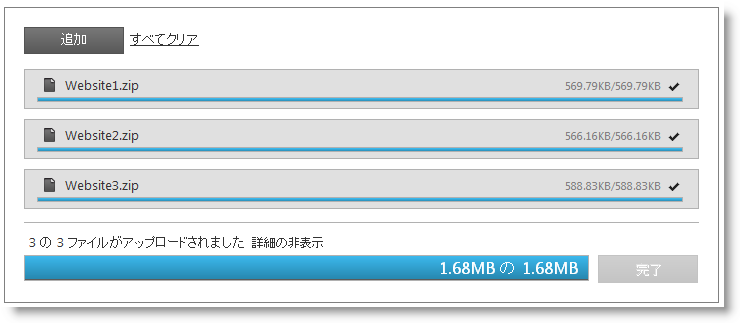
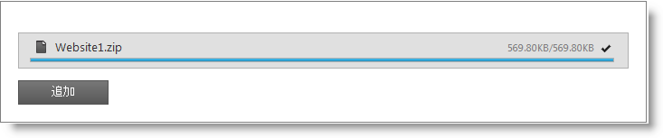

////
|metadata|
{
    "name": "webupload-overview",
    "controlName": ["WebUpload"],
    "tags": ["Getting Started","Selection"],
    "guid": "6e05f08c-f39d-4b88-af97-20d20eb35447",  
    "buildFlags": [],
    "createdOn": "2011-04-01T19:43:46.2598843Z"
}
|metadata|
////

= WebUpload 概要

== WebUpload 概要

{ProductName} アップロード コントロールである WebUpload は、任意の種類のファイルをアップロードして、クライアントブラウザーからサーバーに送信することを可能にするコントロールです。アップロードされたファイルのサイズは、サーバー側の制限にのみ制限されるため、デフォルトの 10MB を超えるサイズの大規模ファイルをアップロードできます。

アップロード コントロールは、シングル アップロード (デフォルト) または同時に複数のファイルのアップロード操作を行うことができます。複数ファイルのアップロードを簡単に行うため、コントロールは HTML iframe 要素を使用してバックグラウンドでファイルをアップロードします。ファイルをアップロードすると、 _iframe_  は HTML DOM 要素として削除されます。*図 1* に示すようにアップロード コントロールをサポートする多数の UI 要素があります。次のような視覚要素があります。

* 個々のファイルのアップロードの進行状況を示すプログレス バー。
* 合計サイズ、アップロード サイズ、ファイル名などの情報。
* ファイル タイプにしたがって変化するアイコン｡
* キャンセル ボタン。

** ファイルがアップロードされると、キャンセル ボタンが消え、その場所に成功インジケーターが表示されます。
** アップロードがキャンセルされると、ファイル情報が非表示になります。

複数ファイルのアップロード中には、次のような視覚要素があります。

* ファイルごとにプログレス バーとキャンセル ボタンがあります。

** キャンセルをクリックすると、個々のファイルはアップロード キューから削除されます。

* サマリー プログレス バーは、すべてのファイルのアップロードの進行状況を表示します。

** 全体をキャンセル ボタンをクリックすると、アップロード全体をキャンセルできます。

== アーキテクチャー

WebUpload コントロールの使用は、2 つの必須部分で構成されます。ひとつはクライアント側の jQuery ウィジェットで、もうひとつはそれぞれのアップロード要求の処理を担当するサーバー側ロジックです。サーバーは、アップロード自体の処理も担当しています。このドキュメントの例では、ASP.NET Framework を使用するサーバー コードを実装しますが、WebUpload コントロールはサーバー技術に依存しません。

アップロード コントロールは、豊富な jQuery API を公開しているため、コントロールをクライアント側で簡単に構成できます。また、Microsoft® ASP.NET MVC フレームワークを使用している開発者はアップロード コントロールのサーバー側ラッパーを活用して、選択した .NET™ 言語でコントロールを構成できます。

WebUpload コントロールは、広範にスタイルでき、デフォルトのスタイルと対照的な全く異なるルック アンド フィールをコントロールに提供する機会を与えます。スタイリング オプションには、独自のスタイルも jQuery UI の ThemeRoller のスタイルも使用できます。

*図 1: ユーザーに提示される WebUpload コントロール*

== 機能

* シングル/マルチ モード。
* デフォルトの 10MB 以上をアップロードします。
* 自動アップロード。
* 複数ファイルの同時アップロード。
* アップロード プロセスをキャンセルします。
* 最大アップロード ファイルを設定します。
* クライアント側/サーバー側のイベント
* 進行状況情報を表示/非表示にします。
* クライアント側/サーバー側の検証
* アップロードされるタイプの制限
* テーマのサポート。
* 進行状況情報とファイルのアップロード状況を変更します。
* ファイルの拡張子にしたがって適切なアイコンを表示します。
* コントロールのラベルのテキストを変更します。

== WebUpload を Web ページに追加

この例は、コントロールのクライアント側ロジックを組み込み、実装する方法、またサーバーがアップロードされたファイルを受信し保存するようサーバー側を構成する方法を示しています。

*注:* サーバー側アーキテクチャと実装の詳細については、 link:webupload-http-module-and-handler.html[「HTTP ハンドラーおよびモジュール」]を参照してください。

このサンプルは、シングル モードでの基本的なアップロード シナリオを示しており、アップロードは自動的に開始します。

*図 2*

link:{SamplesURL}/samples/webupload/display/singleupload/default.aspx?cn=web-upload&sid=bb83f073-cf81-42db-8826-5a430b2a3191[単一の WebUpload のサンプル]

[start=1]
. 最初に、アプリケーションに必要なローカライズ済みのリソースを含めます。 
[start=2]
. ASPX ページでは、必要な JavaScript ファイル、CSS ファイルを参照してください。

[cols="a"]
|====
|*In ASPX:*

|

[source]
---- 
<link type="text/css" href="/Styles/css/themes/infragistics/infragistics.theme.css" rel="stylesheet" />
---- 

[source]
---- 
<link type="text/css" href="/Styles/css/structure/infragistics.css" rel="stylesheet" />
---- 

[source]
---- 

---- 

[source]
---- 
 
 
---- 

|====

[start=3]
. 上記のセットアップが完了したら、ID、 pick:[asp-net="link:{ApiPlatform}web.jquery{ApiVersion}~infragistics.web.ui.editorcontrols.webupload~autostartupload.html[autostartupload]"] 、 pick:[asp-net="link:{ApiPlatform}web.jquery{ApiVersion}~infragistics.web.ui.editorcontrols.webupload~progressurl.html[progressUrl]"]  などのオプションを設定します。最後のプロパティは、ファイルの進行状況またはファイル サイズに関する情報を返し、cancel upload コマンドを扱う HTTP ハンドラーの URL を定義します。サーバー側に接続し、アップロード コントロールを動作させるため、クライアント側ウィジェットで必要なものはそれだけです。残りのオプションにはデフォルト値を設定します。たとえば、アップロード モードの場合は single です。

[cols="a"]
|====
|*ASPX の場合:*

|---- 
<igjq:WebUpload ID="WebUpload1" runat="server" 
 AutoStartUpload="true" ProgressUrl="/WebUploadStatusHandler.ashx"> 
</igjq:WebUpload >
----

|====

[start=4]
. 次に、サーバー側 HTTP ハンドラーとモジュールを構成する必要があります。

== HTTP ハンドラーおよびモジュールの構成

必要とされる HTTP ハンドラーおよびモジュールは、Infragistics.Web.UI dll だけでなく、ASP.NET アップロード ラッパーの一部です。次の手順に従ってそれらを Web.config ファイルに登録します。

[start=1]
. まず最初に、アップロードされたファイルを保存する書き込み許可のあるフォルダー を作成する必要があります。次に、Web.config にそのフォルダーを登録する必要があります（以下参照）。これによって、WebUpload にファイルの保存先が認識されます。現在の例では、Uploads というフォルダーになっています。
[start=2]
. maxFileSizeLimit 設定を行うことで、アップロードされたファイルのサイズを制限できます。このサンプルでは、このサイズは約 100 MB です。

[cols="a"]
|====
|*Web.config の場合:*

|---- 
<appSettings>  <add key="fileUploadPath" value="~/Uploads" /> 
 <add key="maxFileSizeLimit" value="100000000" /> 
</appSettings>
----

|====

.注:
[NOTE]
====
maxFileSizeLimit の値はバイト単位で整数で保存されるため、最大値は 2,147,483,647 です。
====

[start=3]
. モジュールとハンドラーを登録する必要があります。サーバーによっては、Web.config ファイルを構成する必要があります。

== IIS6（および開発環境）の場合

[cols="a"]
|====
|*Web.config の場合:*

|---- 
<system.web>  <httpHandlers>  <add verb="GET" type="Infragistics.Web.UI.EditorControls.UploadStatusHandler" 
 path="WebUploadStatusHandler.ashx" /> 
 </httpHandlers> 
 <httpModules> 
 <add name="IGUploadModule" type="Infragistics.Web.UI.EditorControls.UploadModule" /> 
 </httpModules> 
</system.web>
----

|====

== IIS7 の場合:

[cols="a"]
|====
|*Web.config の場合:*

|---- 
<system.webServer>  <modules runAllManagedModulesForAllRequests="true"> 
 <add name="IGUploadModule" type="Infragistics.Web.UI.EditorControls.UploadModule" 
 preCondition="managedHandler" /> 
 </modules> 
 <handlers> 
 <add name="IGUploadStatusHandler" path="WebUploadStatusHandler.ashx" verb="$$*$$" 
 type="Infragistics.Web.UI.EditorControls.UploadStatusHandler" preCondition="integratedMode" /> 
 </handlers> 
</system.webServer>
----

|====

[start=4]
. web ページを実行して基本の WebUpload コントロールを取得します。これで*図 2* に示すように、WebUpload が公開する進行状況の情報をブラウザーが表示および監視するファイルをファイル ピッカー ウィンドウから選択できます。

*注:* アップロード コントロールを実行することがまだできない場合には、可能性のあるエラーを探し出すために link:{SamplesURL}/samples/webupload/display/clientsideevents/default.aspx?cn=web-upload&sid=beded808-bc61-4eca-a918-c1cba447e1df[「WebUpload クライアント側イベントの例」]に従ってください。クライアント側イベントのトピックでは、クライアント側イベント onError に添付し問題を調査する方法を説明します。

== 関連リンク

link:{SamplesURL}/samples/webupload/display/singleupload/default.aspx?cn=web-upload&sid=bb83f073-cf81-42db-8826-5a430b2a3191[単一の WebUpload のサンプル]

link:{SamplesURL}/samples/webupload/display/clientsideevents/default.aspx?cn=web-upload&sid=beded808-bc61-4eca-a918-c1cba447e1df[WebUpload クライアント側イベントの例]

link:webupload-http-module-and-handler.html[HTTP ハンドラーおよびモジュール]

link:webupload-using-client-side-events.html[クライアント側イベントの使用]