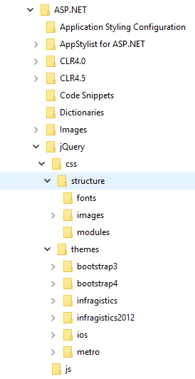
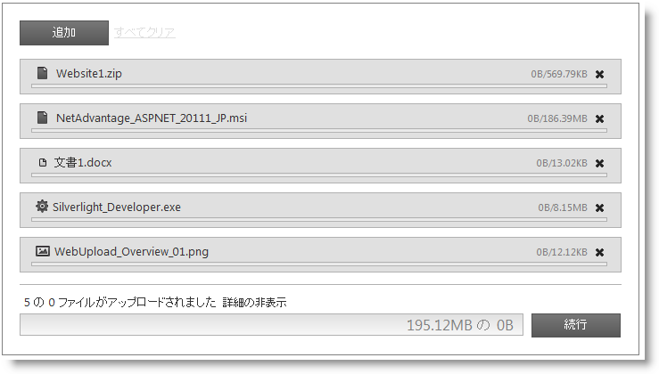

////
|metadata|
{
    "name": "webupload-styling-and-theming",
    "controlName": ["WebUpload"],
    "tags": ["Selection","Styling","Theming"],
    "guid": "48db107f-a5a7-46b7-88ef-dad17f32500d",
    "buildFlags": [],
    "createdOn": "2011-05-26T14:54:03.1194817Z"
}
|metadata|
////

= WebUpload のスタイル設定

このトピックは WebUpload コントロールをカスタマイズして、カスタムのルック アンド フィールを設定する方法を紹介します。コントロールをスタイルするために必要なスクリプトとスタイルについても学習します。

== 必要とされる CSS およびテーマ

{ProductName} アップロード コントロール (または WebUpload) は、他の jQuery ウィジェットのように、スタイリングに jQuery UI CSS Framework を使用します。{ProductName} には、Infragistics および Metro と呼ばれるカスタム jQuery UI テーマが含まれています。これらのテーマによって、Infragistics ウィジェットおよび標準の jQuery UI ウィジェットが、プロフェッショナルで魅力的な外観になります。

Infragistics および Metro テーマに加えて、Infragistics ウィジェットの基本 CSS レイアウトに必要な structure ディレクトリがあります。

== 必要なテーマの Web サイトへの追加

Infragistics および Metro テーマは、jQuery/css フォルダー内のインストール ディレクトリに配置されています。テーマをアプリケーションに追加するには、css フォルダー全体 (structure および themes ディレクトリを含む) をサイトの場所にコピーします。

*図 1: 製品インストール時に含まれるテーマ フォルダー*

== Infragistics および Metro テーマ

Infragistics テーマは、jQuery UI テーマに通常存在するすべてのスタイルを含むカスタム テーマです。このテーマは、別のテーマで置き換えることができますが、ASP.NET コントロールを正しく表示するには、`{IG Resources ルート}/jQuery/css/structure/infragistics.css` ファイルへの参照が必要です。

Metro テーマは、クリーン、モダンかつ高速な Metro デザイン言語の実装です。れには、Infragistics テーマと同様に、`{IG Resources ルート}/jQuery/css/structure/infragistics.css` と同じ要件があります。

WebUpload コントロールには、標準の jQuery UI テーマのスタイルシートへのリンクが必要です。IG テーマの場合、テーマのスタイルシートへの参照をページに含める必要があります:

### リスト 1: Infragistics テーマへの手動 CSS 参照

**HTML の場合:**

[source,html]
----
<link href="css/themes/infragistics/infragistics.theme.css" rel="stylesheet" type="text/css" />
<link href="css/structure/infragistics.css" rel="stylesheet" type="text/css" />
----

Metro テーマは、jQuery テーマの後に参照されます。以下のスタイルシートは必要となります:

### リスト 3: Metro テーマへの手動 CSS 参照

**HTML の場合:**

[source,html]
----
<link href="css/themes/metro/infragistics.theme.css " rel="stylesheet" type="text/css" />
<link href="css/structure/infragistics.css" rel="stylesheet" type="text/css" />
----

== CSS プロパティ

アップロード CSS プロパティは、コントロールのすべてのスタイルが適用されるメンバーです。表 1 は CSS オブジェクト プロパティのすべてのプロパティとそれらに適用されるすべてのルールを示します。これによって、特定のクラスを上書きすることで固有のテーマを作成する自由が与えられます。

*注:* 表にリストされたクラスを上書きするだけでテーマ ローリングはコントロールをテーマ化します。詳細は、 link:{SamplesURL}/samples/webupload/style/themeroller/default.aspx?cn=web-upload&sid=240fe780-34c6-42b2-a188-c2a9aaaf233d[WebUpload テーマ ローラー サンプル]を参照してください。

== 表 1: CSS クラスのリスト

[options="header", cols="a,a,a"]
|====
|CSS オブジェクトのプロパティ|プロパティに適用される CSS クラスのリスト|CSS クラスが適用される領域

|clearClass
|ui-helper-clearfix
|フロート ラッピング プロパティを親要素に適用

|hiddenClass
|ui-helper-hidden
|要素を非表示にする

|baseClassIE6
|ui-ie6
|IE6 のクラス

|baseClassIE7
|ui-ie7
|IE7 のクラス

|baseClassMoz
|ui-moz
|FF のクラス

|baseClassOpera
|ui-opera
|Opera のクラス

|startupBrowseButtonClasses
|ui-igstartupbrowsebutton
|スタートアップ参照ボタンのクラス

|baseClass
|ui-widget 

ui-widget-content 

ui-corner-all 

ui-igupload
|コンテナーのクラス

|baseMainContainerClass
|ui-igupload-basemaincontainer
|単一/複数モードでメイン コンテナーに適用されるクラス

|multipleDialogClasses
|ui-iguploadmultiple
|複数ファイル アップロード モードが選択される時にメイン コンテナーに適用されるクラス

|singleDialogClass
|ui-iguploadsingle
|複数ファイル アップロード モードが選択される時にメイン コンテナーに適用されるクラス

|browseButtonClass
|ui-igupload-browsebutton
|メイン コンテナーのボタン、参照ボタンに適用されるクラス

|containerClass
|ui-igupload-container 

ui-widget-content
|すべてのファイル アップロード プログレス バーを含む DOM 要素に適用されるクラス

|uploadProgressClass
|ui-igupload-uploadprogress
|個々のファイル アップロードを含む div

|fileInfoMainContainer
|ui-igupload-fimaincontainer
|[追加] ボタン、[クリア] ボタンおよびファイルの進行状況の詳細を含む div に適用されるクラス

|progressContainer
|ui-helper-clearfix
|各ファイルの Class コンテナー

|progressBarUploadClass
|ui-igupload-progressbar-upload 

ui-helper-clearfix
|単一のプログレス バーに適用されるクラス

|progressBarFileNameClass
|ui-igupload-progressbar-filename
|サマリー プログレス バーのファイル名 DOM 要素に適用されるクラス

|progressBarFileSizeClass
|ui-igupload-progressbar-filesize
|サマリー プログレス バーのファイル サイズ DOM 要素に適用されるクラス

|progressBarInnerHTMLContainerClass
|ui-igupload-progressbar-container ui-helper-clearfix
|各プログレス バー内のファイル名 DOM 要素およびファイル サイズ DOM 要素のコンテナーのクラス

|containerButtonCancelClass
|ui-container-button-cancel-class ui-helper-clearfix
|プログレス バーに近い [キャンセル]/[完了] ボタンのコンテナーのクラス

|summaryProgressBarClass
|ui-igupload-summaryprogressbar
|サマリー プログレス バーに適用されるクラス

|summaryProgressContainerClass
|ui-igupload-summaryprogresscontainer
|サマリー プログレス バーのコンテナーに適用されるクラス

|summaryProgressbarLabelClass
|ui-igupload-summaryprogress-label
|サマリー プログレス バーのラベルのクラス

|summaryInformationContainerClass
|ui-igupload-summaryinformation-container 

ui-helper-clearfix
|サマリー プログレス領域のコンテナーのクラス、サマリー プログレスのラベルと [詳細を表示/非表示] ボタンを含む

|summaryUploadedFilesLabelClass
|ui-igupload-summaryuploadedfiles-label
|サマリー プログレスの状態を示す DOM 要素に適用されるクラス

|summaryShowHideDetailsButtonClass
|ui-igupload-showhidedetails-button
|サマリー プログレス領域の [詳細を表示/非表示] ボタンのクラス

|summaryButtonClass
|ui-igupload-summary-button
|[キャンセル] ボタンに設定されるクラス

|summaryProgressBarInnerProgress
|ui-igupload-summaryprogres_summpbar_progress
|プログレス DIV 内に設定されるクラス

|summaryProgressBarSecondaryLabel
|ui-igupload-summaryprogress-label 

ui-igupload-summaryprogress-secondary-label
|サマリー プログレス バーの第二のレベルのクラス

|containerFUS
|ui-widget-content 

ui-igupload-progress-container 

ui-corner-all 

ui-helper-clearfix
|プログレス バー、ファイル情報、[キャンセル] ボタンなどをはじめとする、個々のファイルのコンテナーのクラス

|====

注*:* アップロード コントロールでクラスのすべてがカスタムとは限りません。一部は jQuery UI CSS Framework から再利用されます。

== ファイル拡張子アイコン

Upload プロパティ pick:[asp-net="link:{ApiPlatform}web.jquery{ApiVersion}~infragistics.web.ui.editorcontrols.webupload~showfileextensionicon.html[showFileExtensionIcon]"] が True に設定されると、コントロールは、アップロードされるファイルのタイプを示すアイコンをファイル名の左に表示します。

*図 3: アップロードの間のファイル拡張子アイコン*

image::images/WebUpload_Styling_and_Theming_03.png[]

デフォルトで、よく使用される拡張子のほとんどには組み込みアイコンがあります。アイコンでサポートされる種類は以下のカテゴリのとおりです。

[options="header", cols="a,a"]
|====
|ファイルの種類|ファイル拡張子

|アプリケーション
|exe、app

|画像
|gif、jpg、jpeg、png、bmp、uyv、tif、thm、psd

|音楽
|mp3、wav、mp4、aac、mid、wma、ra、iff、aif、m3u、mpa

|ドキュメント
|doc、docx、xls、xlsx、txt、ppt、pptx、pdf

|ビデオ
|3pg、asf、asx、avi、flv、mov、mp4、 mpg、rm、swf、vob、wmv

|====

図 *4* に、複数ファイルのアップロード操作の間にアイコンのデフォルト値がどのように表示されるかを示します。

*図 4: 複数ファイルのアップロード処理の間のアップロード コントロール*

注*:* ファイルの種類が組み込み以外の場合にはデフォルトのアイコンが適用されます。

== ファイル拡張子アイコンの変更

ファイル拡張子アイコンをカスタマイズしたい場合には、新しいアイコンを pick:[asp-net="link:{ApiPlatform}web.jquery{ApiVersion}~infragistics.web.ui.editorcontrols.webupload~fileextensionicons.html[fileExtensionIcons]"] プロパティに提供することでデフォルト値をオーバーライドできます。

*fileExtensionIcons* プロパティは各ファイルの種類にマップするオブジェクトの配列を受け入れます。リスト 1 は既存の拡張子のスタイルを新しい CSS クラスに関連付ける方法を示します。

リスト 1: デフォルトのファイル拡張子のオーバーライド

*JavaScript の場合:*

[source,js]
---- 
fileExtensionIcons: [  {  ext: ['gif', 'jpg', 'jpeg', 'png', 'bmp', 'yuv', 'tif', 'thm', 'psd'], 
 css: 'image-class', 
 def: true 
 }, 
 { 
 ext: ['mp3', 'wav', 'mp4', 'aac', 'mid', 'wma', 'ra', 'iff', 'aif', 'm3u', 'mpa'], 
 css: 'audio-class', 
 def: false 
 } 
]
----

各マッピングは以下の 3 つの値を考慮する必要があります。

* *ext* : アイコンを共有するファイル拡張子の配列
* *css* : ext プロパティで定義された拡張子を持つ各ファイルに適用される CSS クラス
* *def* : これが ext 配列で定義されなかったタイプに適用されるデフォルトのルールかどうかを指定します。

複数のデフォルトのプロパティが設定されたファイル拡張子アイコンがある場合には、最後の定義が優先されます。

== 外部参照

* link:http://jqueryui.com/[jQuery UI]
* link:http://jqueryui.com/themeroller/[jQuery テーマ ローラー]

== 関連リンク

link:{SamplesURL}/samples/webupload/style/themeroller/default.aspx?cn=web-upload&sid=240fe780-34c6-42b2-a188-c2a9aaaf233d[WebUpload ThemeRoller のサンプル]

link:{SamplesURL}/componentoverview.aspx?cn=web-upload[複数ファイル アップロードのサンプル]