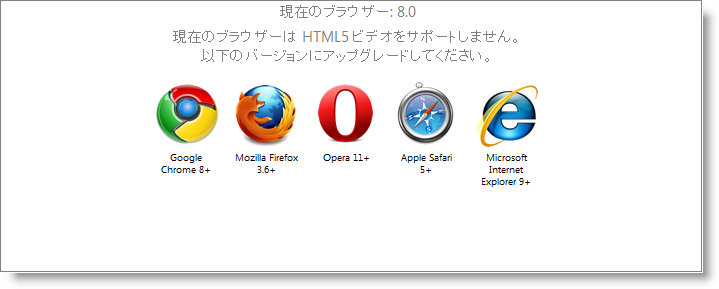

////

|metadata|
{
    "name": "webvideoplayer-working-with-html5-video",
    "controlName": ["WebVideoPlayer"],
    "tags": ["Getting Started"],
    "guid": "705283cd-35ed-4ccc-a39a-be851d9661ff",  
    "buildFlags": [],
    "createdOn": "2011-06-01T08:12:03.9875426Z"
}
|metadata|
////

= WebVideoPlayer を HTML5 ビデオで使用

== はじめに

WebVideoPlayer™ コントロールは、HTML5 固有の <video> タグを使用してビデオを再生します。これは、最も人気のあるブラウザーの以下のバージョンでサポートされています。

[cols="a,a,a,a,a"]
|====
|Internet Explorer|Firefox|Safari|Chrome|Opera

|9+
|3.6+
|5+
|8+
|11.+

|====

これらのブラウザーの古いバージョンは、HTML5 ビデオと互換性がありません。以前のバージョンのブラウザーでコントロールを初期化すると、 pick:[asp-net="link:{ApiPlatform}web.jquery{ApiVersion}~infragistics.web.ui.displaycontrols.videoplayerclientevents~browsernotsupported.html[BrowserNotSupported]"]  イベントが発生することになります。処理されない場合にはそれぞれのサポートされたブラウザーのダウンロード ページへのリンクと共に、ユーザー フレンドリなメッセージが表示されます。

HTML5 ビデオをサポートしないブラウザーの場合に希望する操作が異なる場合には、BrowserNotSupported イベントを処理して、Microsoft® Silverlight™ または Adobe® Flash™ を使用して代替えのビデオ プレーヤーを表示するなどカスタム ロジックを実行できます。以下のコードはこれを示しています。

*ASPX の場合:*

----
<igjq:WebVideoPlayer ID="player1" runat="server">
   <Sources>
      <igjq:VideoPlayerSource Source="example_video1.mp4" />
      <igjq:VideoPlayerSource Source="example_video2.webm" />
      <igjq:VideoPlayerSource Source="example_video3.ogv" />
   </Sources>
   <ClientEvents BrowserNotSupported="onBrowserNotSupported" />
</igjq:WebVideoPlayer>
----

*JavaScript の場合*

----
function onBrowserNotSupported(sender, args) {
            $("#flashContainer").css("display", "block");
            $("#<%= this.player1.ClientID %>").css("display", "none");
            eventArgs.cancel = true;
        }
----

== ビデオ コーデック

それぞれのブラウザーには、ビデオ タグを処理する独自の方法があり、1 つ以上のビデオ コーデックをサポートしています。今のところ、全てをサポートしているコーデックは存在しません。そのため、ビデオを人気のあるブラウザーすべてで表示可能にするには、ビデオを複数回エンコードする必要があります。

現在のブラウザーでサポートされているコーデックの完全なリストを以下に示します。

[options="header", cols="a,a,a,a,a,a"]
|====
|コーデック/コンテナー|IE|Firefox|Safari|Chrome|Opera

|Theora+Vorbis/Ogg
|-
|3.5+
|$$*$$$$* $$
|3.0+
|11+

|H264+AAC/MP4
|9.0+
|-
|5+
|-
|-

|WebM
|9.0+$$*$$
|4.0+
|$$*$$$$* $$
|6.0+
|11+

|====

$$*$$ エンドユーザーが VP8 コーデックをインストールしている場合、Internet Explorer 9 は WebM のみをサポートします。

$$*$$$$* $$ Safari は、Apple® QuickTime™ で再生できるものはなんでも再生できますが、QuickTime では H.264/AAC/MP4 サポートのみがあらかじめインストールされています。

*注:* ブラウザーのサポートに関する最新データについては、 link:http://en.wikipedia.org/wiki/HTML5_video[http://en.wikipedia.org/wiki/HTML5_video] をご覧ください。 link:http://en.wikipedia.org/wiki/HTML5_video[]

多くの場合、上に挙げたコーデック/コンテナーの組み合わせをそれぞれ使用して、ビデオをエンコードする必要があります。3 つのファイルへのパスをコントロールに渡す必要があります。ブラウザーが複数の種類をサポートしている場合、コントロールはブラウザーに最適なものを選択します。優先順位は以下のようになります。

[start=1]
. MP4 コンテナーの H264/AAC
[start=2]
. Ogg コンテナーの Theora/Vorbis
[start=3]
. WebM

選択したソースはビデオ タグの src 属性に追加されます。

組み込み関数を使用して、独立した 3 つのコーデック/コンテナーの組み合わせの互換性を特定のブラウザーでテストすることも可能です。

*JavaScript の場合*

----
var supportsHTML5 = $("#<%= this.player1.ClientID %>").igVideoPlayer("supports_video");
var supportsH264 = $("#<%= this.player1.ClientID %>").igVideoPlayer("supports_h264_baseline_video");
var supportsOgv = $("#<%= this.player1.ClientID %>").igVideoPlayer("supports_ogg_theora_video");
var supportsWebM = $("#<%= this.player1.ClientID %>").igVideoPlayer("supports_webm_video");
----

== 関連トピック

link:webvideoplayer-overview.html[WebVideoPlayer の概要]