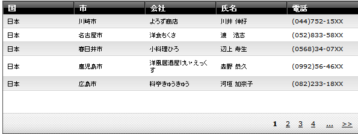
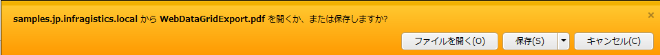

////

|metadata|
{
    "name": "webwordexporter-getting-started-with-webwordexporter",
    "controlName": ["WebWordExporter"],
    "tags": ["Exporting","Getting Started","Grids"],
    "guid": "9b99385f-9987-4aa7-a4d9-a51a67ea841a",  
    "buildFlags": [],
    "createdOn": "2011-10-26T12:55:02.0657202Z"
}
|metadata|
////

= WebWordExporter のセットアップ

このトピックでは、WebDataGrid™/WebHierarchicalDataGrid™ データの Microsoft® Word® ファイルへのエクスポートのセットアップ方法を示しています。

== はじめに

WebDataGrid/WebHierarchicalDataGrid から MS Word® ファイル形式へのデータ エクスポートは WebWordExporter™ コンポーネントで行われます。このコンポーネントは、その型に関係なく WebDataGrid/WebHierarchicalDataGrid コントロールにバインドされたデータをエクスポートできます。(詳細は、 link:webdatagrid-supported-data-sources.html[「サポート対象データ ソース」]トピックを参照してください。)

WebWordExporter は、データ ソースで使用できるよう設定されたデータ全体または現在グリッドに表示されているデータだけエクスポートするよう構成できます。以下のプロシージャ例では、エクスポーターはデータ ソースのすべてのデータをエクスポートするよう構成されています。

このプロシージャは顧客の状態データ (County、City、Company、Contact、および Phone) をエクスポートします。必要な情報は、Northwind サンプル データベースの Cutomers テーブルから取得されます。例では WebDataGrid を使用していますが、WebHierarchicalDataGrid からのエクスポートも同様に動作します。

== プレビュー

以下は最終結果のプレビューです。

== 要件

* WebDataGrid がデータ ソースにバインドされた Web ページ（ASP.NET Web フォーム）。詳細は、 link:webdatagrid-getting-started-with-webdatagrid.html[「WebDataGrid の開始」]を参照してください。この特定の例では、以下のコードを使用します。

*HTML の場合:*

----
<ig:WebDataGrid runat="server" ID="wdgCustomers" 
        DataSourceID="SqlDsCustomers" 
        DataKeyFields="CustomerID" 
        AutoGenerateColumns="
        >
            <Columns>
                <ig:BoundDataField Key="Country" DataFieldName="Country" Header-Text="Country" />
                <ig:BoundDataField Key="City" DataFieldName="City" Header-Text="City" />
                <ig:BoundDataField Key="CompanyName" DataFieldName="CompanyName" Header-Text="Company" />
                <ig:BoundDataField Key="ContactName" DataFieldName="ContactName" Header-Text="Contact" />
                <ig:BoundDataField Key="Phone" DataFieldName="Phone" Header-Text="Phone" />
            </Columns>
        </ig:WebDataGrid>
        <asp:SqlDataSource runat="server"ID="SqlDsCustomers"ConnectionString="<%$ ConnectionStrings:NorthwindConnectionString %>" SelectCommand="SELECT * FROM [Customers] ORDER BY [Country]">
        </asp:SqlDataSource>
----

== 概要

以下はプロセスの概念的概要です。

[start=1]
. WebWordExporter コンポーネントの追加と構成
[start=2]
. データをエクスポートするボタンの追加と構成
[start=3]
. (オプション) 結果の検証

== 手順

[start=1]
. WebWordExporter コンポーネントの追加と構成。

.. WebWordExporter コントロールを Visual Studio Toolbox からページにドラッグします。
.. WebWordExporter の ExportMode プロパティを Download に設定します。
.. コントロールの ID プロパティを WordExporter に設定します。
.. コントロールの DownloadName プロパティを WebDataGridExport に設定します。
.. コントロールの DataExportMode プロパティを AllDataInDataSource に設定します。

*HTML の場合:*

----
<ig:WebWordExporter ID="WordExporter" ExportMode="Download" runat="server"    DownloadName="WebDataGridExport" DataExportMode="AllDataInDataSource"
 />
----

*C# の場合：*

----
        WebWordExporter wordExporter = new WebWordExporter();
        wordExporter.ExportMode = Infragistics.Web.UI.GridControls.ExportMode.Download;
        wordExporter.ID = "WordExporter";
        wordExporter.DownloadName = "WebDataGridExport";
        wordExporter.DataExportMode = Infragistics.Web.UI.GridControls.DataExportMode.AllDataInDataSource;
----

[start=2]
. データをエクスポートするボタンの追加と構成。

.. Button コントロールを Visual Studio Toolbox からページにドラッグします。
.. ボタンの ID プロパティを btnExport に設定します。
.. コントロールの Text プロパティを Export WebDataGrid に設定します。
.. コントロールの OnClick を btnExport_Click に設定します。
.. コード ビハインドで btnExport_Click ハンドラーを定義し、WebExcelExporter Export() メソッド オーバーロードのひとつを呼び出します。

*HTML の場合:*

----
<asp:Button runat="server" ID="btnExport" Text="Export Data" OnClick="btnExport_Click" />
----

*C# の場合：*

----
protected void btnExport_Click(object sender, EventArgs e)
{
    this.WordExporter.Export(this.wdgCustomers);
}
----

[start=3]
. (オプション) 結果を検証します。

.. アプリケーションを実行します。
.. グリッド データをエクスポートします。

データをエクスポートするには、Export WebDataGrid ボタンをクリックします。ブラウザーで WebDataGridExport.doc という名前のファイルを開くか保存するかを尋ねられます。

.. Open ボタンをクリックし、エクスポート データを Word で開きます。

手順を正しく実装した場合、エクスポート データは上記のプレビューのように表示されるはずです。

== 関連トピック

以下は、その他の役立つトピックです。

* link:webwordexporter-about-webwordexporter.html[WebWordExporter について ]
* link:webwordexporter-api-overview.html[API の概要]