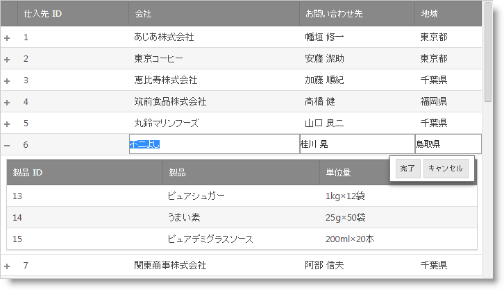
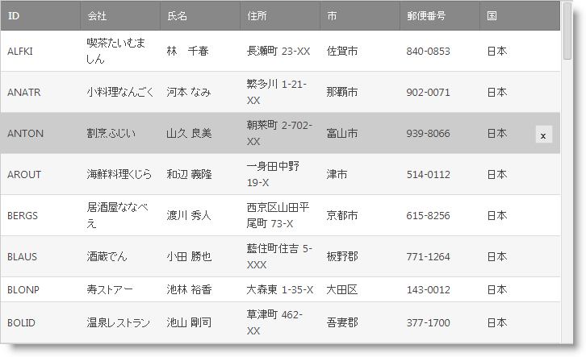

////

|metadata|
{
    "name": "whats-new-14-1",
    "controlName": [],
    "tags": [],
    "guid": "f839c73d-09f3-4924-a044-392e271ac3ae",  
    "buildFlags": [],
    "createdOn": "2014-03-11T14:46:22.5474277Z"
}
|metadata|
////

= 2014 Volume 1 の新機能

== トピックの概要

=== 目的

このトピックでは、Infragistics® ASP.NET 2014 Volume 1 リリースの新機能の概要について紹介します。

== 新機能の概要

=== 新機能の概要表

以下の表は 2014 Volume 1 リリースの新機能の概要を提供します。詳細については、概要表の後をご覧ください。

==== <<_Ref367305754,全般>>

[options="header", cols="a,a"]
|====
|機能|説明

|<<_Ref382485996,新しいデフォルトのルック アンド フィール>>
|{ProductName} コントロールの新しいデフォルト テーマがあります。

|<<_Ref382486066,新しい Visual Studio テンプレート>>
|Microsoft® Visual Studio® のファイル > 新しいプロジェクト ダイアログで新しい Infragistics テンプレートを提供します。

|====

==== _<<_Ref382591305,WebDataGrid と WebHierarchicalDataGrid>>_

[options="header", cols="a,a"]
|====
|機能|説明

|<<_Ref382213299,行の編集動作>>
|行編集動作は、編集モードが向上された機能です。ユーザーに高い編集エクスペリエンスを提供します。

|<<_Ref382213310,[削除] ボタン>>
|有効の場合、[削除] ボタンは、行の上に表示されます。

|====

[[_Ref367305754]]

== 全般

[[_Ref382485996]]

=== 新しいデフォルトのルック アンド フィール

Web アプリケーションの最新ルック アンド フィールに合うため、すべての {ProductName} コントロールに新しいデフォルト テーマを追加しました。以前のデフォルト テーマの名前を IG2007 に変更しました。

[[_Ref382486066]]

=== 新しい Visual Studio テンプレート

Visual Studio 2012 以後のバージョンでファイル > 新しいプロジェクト ダイアログから新しい Infragistics テンプレートをダウンロードできます。このテンプレートを使用することで高度な機能、デザイン、スタイルを持つアプリケーションの作成作業をすぐに開始できます。

各テンプレートでヘルプが提供されます。複数のアプリケーション シナリオに合わせるために Infragistics テンプレート ギャラリーにテンプレートを追加する予定があります。

image::images/Whats_New_Project_Dialog.png[]

[[_Ref367305775]]

[[_Ref382591305]]
== WebDataGrid と WebHierarchicalDataGrid

[[_Ref382213299]]

=== 行の編集動作

行編集動作は、編集モードが向上された機能です。ユーザーに高い編集エクスペリエンスを提供します。行編集を使用すると、編集中の行はすべてのセルにエディターを表示します。編集中の行にダイアログで新しい [完了] および [キャンセル] ボタンが表示されます。このボタンは、保留中の編集を保存するか、キャンセルします。

==== 関連トピック:

* link:webdatagrid-row-editing-overview.html[行編集の概要 (WebDataGrid)]
* link:whdg-row-editing-overview.html[行編集の概要 (WebHierarchicalDataGrid)]

[[_Ref382213310]]

=== [削除] ボタン

有効の場合、[削除] ボタンは、行の上に表示されます。アプリケーションのルック アンド フィールと合わせるためにボタンのスタイルを設定できます。

==== 関連トピック:

* link:webdatagrid-row-deleting-overview.html[行削除の概要 (WebDataGrid)]
* link:whdg-row-deleting-overview.html[行削除の概要 (WebHierarchicalDataGrid)]