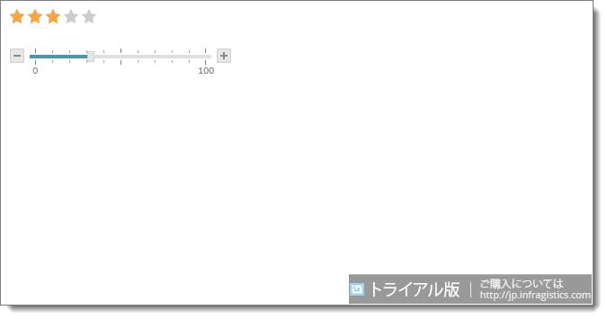

////
|metadata|
{
    "name": "whats-new-in-2016-volume-2",
    "controlName": [],
    "tags": [],
    "guid": "69ad0921-6a3b-4035-808d-fee0d0c6666c",
    "buildFlags": [],
    "createdOn": "2016-09-29T13:26:10.292549Z"
}
|metadata|
////

= 2016 Volume 2 の新機能

このトピックでは、{ProductName} 2016 Volume 2 リリースで導入された新しいコントロールと機能の概要について説明します。

== 全般

[[Watermark]]

=== ASP.NET コントロールのライセンス形態は廃止され、トライアル ウォーターマークに置き換わりました。

Infragisitcs ASP.NET コントロールの所有権の確認を目的としたサーバー コントロール ライセンス構造が廃止されました。つまり、製品のトライアル版をインストールした場合に製品版として使用できますが、Infratistics ASP.NET コントロールを含むウェブページを実行したときにウォーターマークがページ右下に表示されます。この新しい変更により製品のトライアル版に使用期限がなくなります。ただし、製品版にアップグレードしない限りウォーターマークが表示されます。以下の画像は、トライアル版の {ProductName} コントロールを含むウェブページを示します。

=== ASP.NET NuGet パッケージの追加

ASP.NET NuGet パッケージが 2016 Volume 2 リリースより追加されました。これらのパッケージでアプリケーションをより速くセットアップできるため、生産性の向上につながります。パッケージにはプロジェクトに必要な参照が自動的に含まれます。

NuGet パッケージは製品インストーラーとともに新しいローカル フィードが作成される際にインストールされます。NuGet パッケージ マネージャーを設定する必要はありません。次回 Visual Studio を実行した際にローカル NuGet フィード Infragistics (ローカル) が表示されます。

==== 関連トピック

link:aspnet-nuget.html[ASP.NET NuGet パッケージの使用]