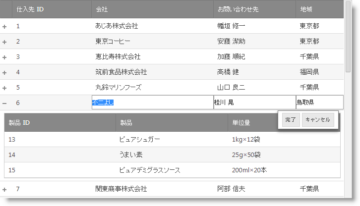
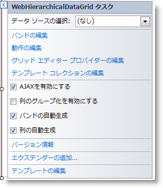
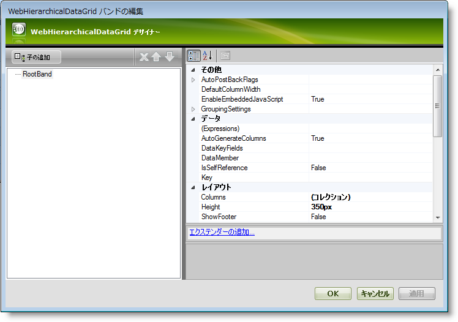
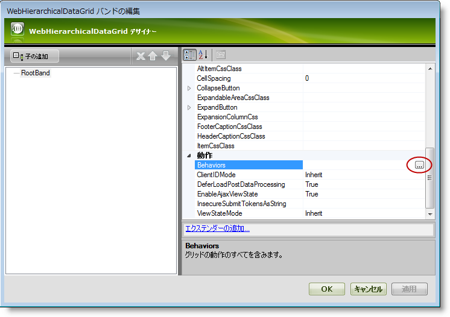
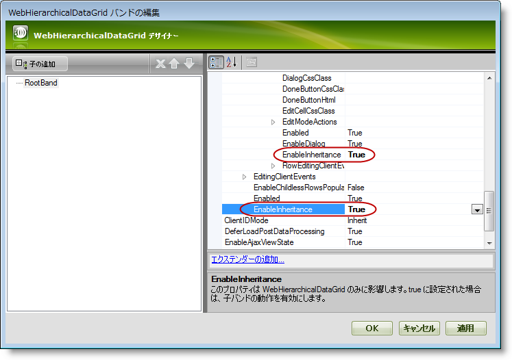

////
|metadata|
{
    "name": "whdg-enabling-row-editing",
    "controlName": [],
    "tags": [],
    "guid": "370935cb-08bd-4dcc-828b-5bdde8449c4b",  
    "buildFlags": [],
    "createdOn": "2014-03-10T17:12:24.2498306Z"
}
|metadata|
////

= 行編集を有効にする

== トピックの概要

=== 目的

このトピックは、 _WebHierarchicalDataGrid_   __™__  で行編集動作を有効にする方法を説明します。

=== 前提条件

このトピックをより理解するために、以下のトピックを参照することをお勧めします。

[options="header", cols="a,a"]
|====
|トピック|目的

| link:whdg-row-editing-overview.html[行編集の概要]
|このトピックでは、行編集動作の機能の概要を提供します。

| link:webhierarchicaldatagrid-getting-started-with-webhierarchicaldatagrid.html[WebHierarchicalDataGrid を使用した作業の開始]
|このトピックでは、SqlDataSource にバインドされる基本 _WebHierarchicalDataGrid_ を作成する方法を紹介します。

|====

=== このトピックの内容

このトピックは、以下のセクションで構成されます。

* <<_Ref382256645, はじめに >>

** <<OLE_LINK236,行編集の有効化の概要>>
** <<_Ref382246047,行編集の有効化の概要表>>

* <<_Ref382204188, WebHierarchicalDataGrid デザイナーで行編集の有効化 >>

** <<_Ref382256699,はじめに>>
** <<OLE_LINK77,プレビュー>>
** <<OLE_LINK41,前提条件>>
** <<_Ref382256737,概要>>
** <<_Ref382256750,手順>>

* <<_Ref382204208, ASPX マークアップで行編集の有効化 >>

** <<_Ref382256787,はじめに>>
** <<_Ref382256797,プレビュー>>
** <<_Ref382256808,前提条件>>
** <<_Ref382256817,概要>>
** <<_Ref382256825,手順>>

* <<_Ref382204226, コード ビハインドで行編集の有効化 >>

** <<_Ref382256843,はじめに>>
** <<_Ref382256851,プレビュー>>
** <<_Ref382256862,前提条件>>
** <<_Ref382256872,概要>>
** <<_Ref382256879,手順>>

* <<_Ref382204244, 関連コンテンツ >>

** <<_Ref382256939,トピック>>
** <<_Ref382256948,サンプル>>

[[_Ref382246037]]
[[_Ref382256645]]
[[_Ref382204188]]
== はじめに

=== 行編集の有効化の概要

デフォルトで、行編集は無効に設定されています。 _WebHierarchicalDataGrid_   デザイナー、ASPX マークアップ、またはコード ビハインドで有効できます。以下で詳細を説明します。

[[_Ref382246047]]

=== 行編集の有効化の概要表

以下の表は、 _WebHierarchicalDataGrid_   の行編集を有効にする方法の概要を提供します。詳細手順は表の下に説明されます。

=== デザイナーで行編集の有効化

_WebHierarchicalDataGrid_   のスマート タグからデザイナーを起動し、行の編集および編集コアの動作を有効にします。

=== ASPX マークアップで行編集の有効化

Web フォームに ASPX マークアップを追加し、行の編集および編集コアの動作を有効にします。

=== コード ビハインドで行編集の有効化

コード ビハインドで作成し、行の編集および編集コアの動作を有効にします。

[[_Ref382204188]]
== _WebHierarchicalDataGrid_  デザイナーで行編集の有効化

[[_Ref382256699]]

=== はじめに

この例は、 _WebHierarchicalDataGrid_   コントロールのデザイナーで行の編集および編集コアの動作を有効にします。

=== プレビュー

以下のスクリーンショットは最終結果のプレビューです。

=== 前提条件

この手順を実行するには、以下が必要です。

* ASP.NET Visual Studio® web サイトまたは web アプリケーション
* Web フォームに追加した ScriptManager または  _WebScriptManager_™
* 階層データ ソースにバインドされた  _WebHierarchicalDataGrid_  。

[[_Ref382256737]]

=== 概要

以下はプロセスの概要です。

*1.バンドの動作オプションにアクセス*

*2.特定のバンドで行編集の有効化*

*3.*  _(オプション)_    * すべてのバンドで行編集の有効化*

*4.*  _(オプション)_    * 結果の検証*

[[_Ref382256750]]

=== 手順

以下の手順では、デザイナーで行編集を有効にする方法を示します。

=== 1.バンドの動作オプションにアクセスします。

*WebHierarchicalDataGrid のスマート タグを開きます。*

ASPX ページのデザイナーでスマート タブ ボタンをクリックすると、 _WebHierarchicalDataGrid_   のデザイナーを開きます。

 *2.「バンドの編集」リンクをクリックします。* 

利用可能なバンドを編集するためのデザイナーを開きます。

=== 2.特定のバンドで行編集を有効にします。

*1.動作のデザイナーを開きます。*

親バンドを選択し、ツリーの「動作」ノードを展開します。`Behaviors` プロパティを選択し、省略記号 […] ボタンをクリックします。

*注:* 特定のバンドを選択すると、そのバンドのみに行編集動作を有効できます。

 *2.行編集の動作を選択します。* 

行編集の動作の隣のチェックボックスを選択します。このチェックボックスをクリックすると、編集コアの動作も有効にします。

=== 3.(オプション) すべてのバンドで行編集を有効にします。

*1.バンドのデザイナーを開きます。*

ASPX ページのデザイナーでスマート タブ ボタンの「バンドの編集」リンクをクリックすると、 _WebHierarchicalDataGrid_   のデザイナーを開きます。

 *2.EditingCore および行編集動作で継承を有効にします。* 

親データ ビューが選択されていることを確認します。この場合、 _SqlDataSource1_DefaultView_   と呼ばれます。プロパティ グリッドで EditingCore および RowEditing 動作の `EnableInheritance` プロパティを設定します。

*3.デザイナーを閉じます。*

=== 4.(オプション) 結果を検証します。

結果を検証するために、MVC プロジェクトを実行します。**結果を検証するために、** *プロジェクトを実行します。親バンドおよびすべての子バンドの行を編集できます。* 

[[_Ref382204208]]
== ASPX マークアップで行編集の有効化

[[_Ref382256787]]

=== はじめに

Web フォームに ASPX マークアップを追加し、行の編集および編集コアの動作を有効にします。このマークアップは、デザイナーの使用で生成されたマークアップと同じです。(<<_Ref382256486,WebHierarchicalDataGrid デザイナーで行編集の有効化>>を参照してください。)行編集の動作は EditingCore の動作が必要ため、その動作も追加します。

[[_Ref382256797]]

=== プレビュー

以下のスクリーンショットは最終結果のプレビューです。

[[_Ref382256808]]

=== 前提条件

この手順を実行するには、以下が必要です。

* ASP.NET Visual Studio web サイトまたは web アプリケーション
* 階層データ ソースにバインドされた  _WebHierarchicalDataGrid_  。
* プロジェクトに含まれ、 _web.config_   ファイルで構成された ig_res フォルダーおよびスタイルセット
* フォームで  _Infragistics.Web.UI_   および  _Infragistics.Web.UI.GridControls_   名前空間を `ig` タグ プレフィックスと登録します

[[_Ref382256817]]

=== 概要

以下はプロセスの概要です。

*1.ASPX マークアップで親グリッドの行編集を有効にします。*

*2.*  *_(オプション)_*   *子バンドで行編集を有効にします。*

*3.*  *(オプション)*   *すべてのバンドで行編集を有効にします。*

*4.*  *(オプション)*   * 結果を検証します。*

[[_Ref382256825]]

=== 手順

以下の手順では、ASPX マークアップで行編集の動作を有効にする方法を示します。

=== 1.ASPX マークアップで親グリッドの行編集を有効にします。

*1.EditingCore 動作を*   *_WebHierarchicalDataGrid_*   *の動作コレクションに追加します。*

`Behaviors` タグは `WebHierarchicalDataGrid` タグの中に追加します。その他の動作が定義された場合、EditingCore 動作は `Behaviors` タグで動作の兄弟として追加されます。

*ASPX の場合:*

[source,html]
----
<ig:WebHierarchicalDataGrid ID="WebHierarchicalDataGrid1" runat="server">
    <Behaviors>
        <ig:EditingCore>
        </ig:EditingCore>
    </Behaviors>
</ig:WebHierarchicalDataGrid>
----

 *2.RowEditing 動作を EditingCore の動作コレクションに追加します。* EditingCore 動作はグリッドのような `Behaviors` コレクションがあります。RowEditing 動作は `EditingCore` タグの `Behaviors` タブに定義されます。

*ASPX の場合:*

[source,html]
----
<ig:EditingCore>
    <Behaviors>
        <ig:RowEditing></ig:RowEditing>
    </Behaviors>
</ig:EditingCore>
----

*3.ページの ASPX ファイルを保存します。*

コードおよびグリッドは以下のコード要素および機能があります。

*ASPX の場合:*

[source,html]
----
<ig:WebHierarchicalDataGrid ID="WebHierarchicalDataGrid1" runat="server">
    <Behaviors>
        <ig:EditingCore>
            <Behaviors>
                <ig:RowEditing></ig:RowEditing>
            </Behaviors>
        </ig:EditingCore>
    </Behaviors>
</ig:WebHierarchicalDataGrid>
----

=== 2.(オプション) 子バンドで行編集を有効にします。

*1.EditingCore 動作を特定のバンドの動作コレクションに追加します。*

ASPX で定義された各バンドは Behaviors コレクションがあります。その他の動作が定義された場合、EditingCore 動作は `Behaviors` タグで動作の兄弟として追加されます。

*ASPX の場合:*

[source,html]
----
<ig:Band AutoGenerateColumns=" DataMember="SqlDataSource2_DefaultView" Key="SqlDataSource2_DefaultView">
    <Behaviors>
        <ig:EditingCore>
        </ig:EditingCore>
    </Behaviors>
</ig:Band>
----

 *2.RowEditing 動作を EditingCore の動作コレクションに追加します。* EditingCore 動作はグリッドのような `Behaviors` コレクションがあります。RowEditing 動作は `EditingCore` タグの `Behaviors` タブに定義されます。

*ASPX の場合:*

[source,html]
----
<ig:EditingCore>
    <Behaviors>
        <ig:RowEditing></ig:RowEditing>
    </Behaviors>
</ig:EditingCore>
----

*3.ページの ASPX ファイルを保存します。*

コードおよびグリッドは以下のコード要素および機能があります。

*ASPX の場合:*

[source,html]
----
<ig:Band AutoGenerateColumns=" DataMember="SqlDataSource2_DefaultView" Key="SqlDataSource2_DefaultView" >
    <Behaviors>
        <ig:EditingCore>
            <Behaviors>
                <ig:RowEditing></ig:RowEditing>
            </Behaviors>
        </ig:EditingCore>
    </Behaviors>
</ig:Band>
----

=== 3.(オプション) すべてのバンドで行編集を有効にします。

*EditingCore および RowEditing 動作で EnableInheritance を true に設定します。*

グリッドの動作コレクションで、EditingCore および RowEditing 動作の EnableInheritance を true に設定します。

*ASPX の場合:*

[source,html]
----
<ig:WebHierarchicalDataGrid ID="WebHierarchicalDataGrid1" runat="server">
    <Behaviors>
        <ig:EditingCore EnableInheritance="true">
            <Behaviors>
                <ig:RowEditing EnableInheritance="true"></ig:RowEditing>
            </Behaviors>
        </ig:EditingCore>
    </Behaviors>
</ig:WebHierarchicalDataGrid>
----

=== 4.(オプション) 結果を確認します。

結果を検証するために、MVC プロジェクトを実行します。**結果を検証するために、** *プロジェクトを実行します。指定したバンドの行編集動作を有効にしました。* 

[[_Ref382204226]]
== コード ビハインドで行編集の有効化

[[_Ref382256843]]

=== はじめに

この手順は、ランタイムにコード ビハインドで  _WebHierarchicalDataGrid_   に RowEditing 動作を追加します。この方法は、条件付きで動作を追加する場合に便利です。RowEditing 動作は EditingCore 動作の Behaviors コレクションに追加されます。つまり、ランタイムに EditingCore 動作も追加します。

各バンドおよび親  _WebHierarchicalDataGrid_   の動作を変更するには、InitializeBand イベントを使用してください。初期化されているバンドを決定するには、バンドの一意識別子として操作する DataMember プロパティを使用します。このイベントでバンドを変更する場合、変更を適用するために  _WebHierarchicalDataGrid_   の `RefreshBehaviors` メソッドを呼び出してください。動作の定義はデフォルトで ViewState に保存されるので、初期読み込みのみで変更を実行します。ポストバックで動作を変更しない場合、ポストバックに実行する必要がありません。

[[_Ref382256851]]

=== プレビュー

以下のスクリーンショットは最終結果のプレビューです。

[[_Ref382256862]]

=== 前提条件

この手順を実行するには、以下が必要です。

* ASP.NET Visual Studio web サイトまたは web アプリケーション
* 階層データ ソースにバインドされた  _WebHierarchicalDataGrid_  。
* プロジェクトに含まれ、 _web.config_   ファイルで構成された ig_res フォルダーおよびスタイルセット
*  _Infragistics.Web.UI.GridControls_   名前空間の using ステートメント

[[_Ref382256872]]

=== 概要

以下はプロセスの概要です。

*1.InitializeBand イベントのイベント ハンドラーの作成*

*2.InitializeBand イベントでコード ビハインドに行編集の有効化*

*3.*  _(オプション)_    *コード ビハインドにすべてのバンドで行編集の有効化*

*4.*  _(オプション)_    * 結果の検証*

[[_Ref382256879]]

=== 手順

以下の手順では、コード ビハインドで行編集の動作を有効にする方法を示します。

=== 1.InitializeBand イベントでイベント ハンドラーを作成します。

*InitializeBand イベントでイベントおよびイベント ハンドラーを作成します。*

*C# の場合:*

[source,csharp]
----
using Infragistics.Web.UI.GridControls;
protected void Page_Init(object sender, EventArgs e)
{
    this.WebHierarchicalDataGrid1.InitializeBand += new InitializeBandEventHandler(WebHierarchicalDataGrid1_InitializeBand);
}
void WebHierarchicalDataGrid1_InitializeBand(object sender, BandEventArgs e)
{
}
----

=== 2.InitializeBand イベントでコード ビハインドに行編集を有効にします。

 *1.指定したバンドに EditingCore および RowEditing 動作を追加します。* InitializeBand イベントは各バンドで発生するため、バンドの DataMember プロパティを取得し、そのバンドに変更を適用します。この例では、 _SqlDataSource1_DefaultView_  バンドに EditingCore および RowEditing 動作を追加します。

*C# の場合:*

[source,csharp]
----
void WebHierarchicalDataGrid1_InitializeBand(object sender, BandEventArgs e)
{
    WebHierarchicalDataGrid grid = sender as WebHierarchicalDataGrid;
    if (grid != null)
    {
        if (!this.IsPostBack && e.Band.DataMember == "SqlDataSource1_DefaultView")
        {
            e.Band.Behaviors.CreateBehavior<EditingCore>();
            e.Band.Behaviors.EditingCore.Behaviors.CreateBehavior<RowEditing>();
        }
    }
}
----

*3.バンドを変更した後に RefreshBehaviors を呼び出します。*

*C# の場合:*

[source,csharp]
----
grid.RefreshBehaviors();
----

*4.コード ビハインド ファイルを保存します。*

コードおよびグリッドは以下のコード要素および機能があります。

*C# の場合:*

[source,csharp]
----
void WebHierarchicalDataGrid1_InitializeBand(object sender, BandEventArgs e)
{
    WebHierarchicalDataGrid grid = sender as WebHierarchicalDataGrid;
    if (grid != null)
    {
        if (!this.IsPostBack && e.Band.DataMember == "SqlDataSource1_DefaultView")
        {
            e.Band.Behaviors.CreateBehavior<EditingCore>();
            e.Band.Behaviors.EditingCore.Behaviors.CreateBehavior<RowEditing>();
        }
        grid.RefreshBehaviors();
    }
}
----

=== 3.(オプション) コード ビハインドにすべてのバンドで行編集を有効にします。

*EditingCore および RowEditing 動作で EnableInheritance を*   _true_    *に設定します。*

InitializeBand イベント ハンドラーで、EditingCore および RowEditing 動作の `EnableInheritance` を  _true_  に設定します。

*C# の場合:*

[source,csharp]
----
void WebHierarchicalDataGrid1_InitializeBand(object sender, BandEventArgs e)
{
    WebHierarchicalDataGrid grid = sender as WebHierarchicalDataGrid;
    if (grid != null)
    {
        if (!this.IsPostBack && e.Band.DataMember == "SqlDataSource1_DefaultView")
        {
            e.Band.Behaviors.CreateBehavior<EditingCore>();
            e.Band.Behaviors.EditingCore.Behaviors.CreateBehavior<RowEditing>();
            e.Band.Behaviors.EditingCore.EnableInheritance = true;
            e.Band.Behaviors.EditingCore.Behaviors.RowEditing.EnableInheritance = true;
        }
        grid.RefreshBehaviors();
    }
}
----

=== 4.(オプション) 結果を確認します。

結果を検証するために、MVC プロジェクトを実行します。**結果を検証するために、** *プロジェクトを実行します。行編集が有効なバンドを選択し、行をダブルクリックします。行は編集モードに入ります。* 

[[_Ref382204244]]
== 関連コンテンツ

[[_Ref382256939]]

=== トピック

このトピックの追加情報については、以下のトピックも合わせてご参照ください。

[options="header", cols="a,a"]
|====
|トピック|目的

| link:webhierarchicaldatagrid-editing-behavior-overview.html[編集動作の概要]
|このトピックは、 _WebHierarchicalDataGrid_ の編集動作についての情報を提供します。

| link:webdatagrid-enabling-row-editing.html[行編集を有効にする]
|このトピックは、 _WebDataGrid_™ で行編集動作を有効にする方法を説明します。

|====

[[_Ref382256948]]

=== サンプル

このトピックについては、以下のサンプルも参照してください。

[options="header", cols="a,a"]
|====
|サンプル|目的

| link:{SamplesURL}/samples/webhierarchicaldatagrid/editingandselection/roweditingbands/default.aspx?cn=hierarchical-data-grid&sid=3e12caf0-e13c-41b2-8ea4-9aaae176dc46[行の編集]
|このサンプルでは、[完了]/[キャンセル] ボタンを使用する行編集動作を表示し、編集中の行の各セルにエディターを表示します。

| link:{SamplesURL}/samples/webdatagrid/style/customizedroweditingappearance/default.aspx?cn=data-grid&sid=68662f24-5cde-4ccf-8bed-4b9c4b0b12d2[カスタム行編集の外観]
|[完了]/[キャンセル] ボタンを非表示、またはボタンのカスタム HTML および CSS クラスを提供して、行編集動作の外観をカスタマイズできます。同じ概念を _WebDataGrid_ および _WebHierarchicalDataGrid_ に適用できます。

| link:{SamplesURL}/samples/webdatagrid/editingandselection/roweditingclientevents/default.aspx?cn=data-grid&sid=ab92894d-bd30-4f45-9462-51b6500cb1e9[行編集のクライアント イベント]
|このサンプルでは、行編集動作をカスタマイズするために EnteringEditMode および ExitingEditMode イベントを使用する方法を紹介します。同じ概念を _WebDataGrid_ および _WebHierarchicalDataGrid_ に適用できます。

|====