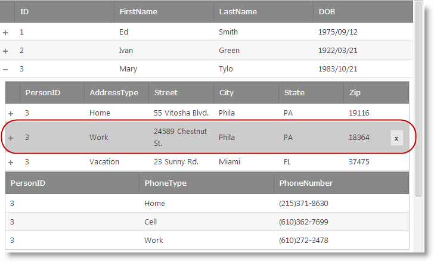

////

|metadata|
{
    "name": "whdg-row-deleting-overview",
    "controlName": [],
    "tags": [],
    "guid": "d6c9f6a9-da2e-4ff9-a124-b77bd90636d7",  
    "buildFlags": [],
    "createdOn": "2014-03-10T17:14:37.5074728Z"
}
|metadata|
////

= 行削除の概要

== トピックの概要

=== 目的

このトピックでは、 _WebHierarchicalDataGrid_   __™__  の行削除動作の機能の概要を提供します。

=== 前提条件

このトピックをより理解するために、以下のトピックを参照することをお勧めします。

[options="header", cols="a,a"]
|====
|トピック|目的

| link:webhierarchicaldatagrid-behaviors.html[動作]
|このトピックは、 _WebHierarchicalDataGrid_ の動作を説明します。

| link:whdg-row-editing-overview.html[行編集の概要]
|このトピックでは、 _WebHierarchicalDataGrid_ の編集機能 (`EditingCore` 動作) の概要を提供します。

|====

=== このトピックの内容

このトピックは、以下のセクションで構成されます。

* <<_Ref382264044,はじめに>>
* <<_Ref382264049,主要機能>>
* <<_Ref382264057,ユーザー インタラクションと操作性>>
* <<_Ref382264063,行削除の動作イベント>>
* <<_Ref382264072,関連コンテンツ>>

** <<_Ref382264076,トピック>>
** <<_Ref382264081,サンプル>>

[[_Ref382264044]]

== はじめに

=== 行削除の概要

行削除の動作は  _WebHierarchicalDataGrid_   の削除機能を提供します。動作の必要なクライアント側の HTML および JavaScript は、動作が有効の場合のみに描画されます。デフォルトで、行を選択して、Delete キーを押すことによって行を削除できます。そのためグリッドに選択動作を含み、RowSelectType をデフォルト値 (None) 以外に設定する必要があります。明示的なユーザー インターフェイスを提供するには、[削除] ボタンを有効にするオプションがあります。その他の編集動作と同じように、行削除動作をグローバルに構成するか、特定のバンドに構成できます。

[[_Ref382264049]]
== 主要機能

=== 主要な機能の概要表

以下の表で、 _WebHierarchicalDataGrid_   の行編集の動作の主要な機能を簡単に説明します。

[options="header", cols="a,a"]
|====
|機能|説明

|キーボードの削除
|デフォルトで、行削除の動作は、ユーザーが Delete キーを押すと、行を削除します。

|[削除] ボタン
|有効の場合、[削除] ボタンは、マウスが行の上にホバーするときに表示されます。

|====

[[_Ref381987257]]

[[_Ref382264057]]
== ユーザー インタラクションと操作性

=== ユーザー インタラクションの概要表

以下の表で、 _WebHierarchicalDataGrid_   の行削除の動作のユーザー インタラクション機能を簡単に説明します。

[options="header", cols="a,a,a,a"]
|====
|目的|方法|詳細|構成方法

|行の削除
|Delete キー 

マウス ホバーで表示する [削除] ボタン
|行削除の動作および選択の動作が有効の場合、ユーザーが行を選択し、Delete キーを押すと、選択した行を削除します。
|image::images/workaround.png[] 

[削除] ボタンを有効にするには、行削除の動作の link:{ApiPlatform}web{ApiVersion}~infragistics.web.ui.gridcontrols.rowdeleting~showdeletebutton.html[ShowDeleteButton] プロパティを設定します。

|====

[[_Ref381987341]]

[[_Ref382264063]]
== 行削除の動作イベント

=== 行削除の動作イベント参照

行削除の動作は、クライアント側の機能をカスタマイズするために使用される以下のクライアント側イベントがあります。

[options="header", cols="a,a"]
|====
|イベント|説明

|`DeleteButtonDisplaying`
|マウスが行の上にホバーされたとき、[削除] ボタンを表示する前に発生します。このイベントは、[削除] ボタンが有効の場合のみに発生します。このイベントはキャンセル可能です。

|`DeleteButtonDisplayed`
|マウスが行の上にホバーされたとき、[削除] ボタンを表示した後に発生します。このイベントは、[削除] ボタンが有効の場合のみに発生します。

|`DeleteButtonHidden`
|マウスが行の上から離れたとき、[削除] ボタンを非表示した後に発生します。このイベントは、[削除] ボタンが有効の場合のみに発生します。

|====

==== 関連サンプル:

* link:{SamplesURL}/samples/webdatagrid/style/customizeddeleterowbutton/default.aspx?cn=data-grid&sid=ab99295d-bd09-4f41-9462-51b6500cb1e9[カスタム行の削除ボタン]

[[_Ref382264072]]
== 関連コンテンツ

[[_Ref382264076]]

=== トピック

このトピックの追加情報については、以下のトピックも合わせてご参照ください。

[options="header", cols="a,a"]
|====
|トピック|目的

| link:webhierarchicaldatagrid-enabling-row-deleting.html[行の削除を有効にする]
|このトピックは、 _WebHierarchicalDataGrid_ で行削除動作を有効にする方法を説明します。

|====

[[_Ref382264081]]

=== サンプル

このトピックについては、以下のサンプルも参照してください。

[options="header", cols="a,a"]
|====
|サンプル|目的

| link:{SamplesURL}/samples/webdatagrid/editingandselection/deleterowsbasicfeatures/default.aspx?cn=data-grid&sid=8ad22332-bd3a-4fdf-ba35-e3f4d8c49b9b[行の削除 - 基本機能]
|_WebHierarchicalDataGrid_ は、エンドユーザーが バインド データ ソースから 1 行以上のデータを削除できる行削除の動作を含みます。このサンプルは、ユーザーが削除アイコンをクリックしたときに現在の行がバインドされたデータソースから削除されるよう動作を設定する方法を紹介します。同じ構成を _WebDataGrid_™ および _WebHierarchicalDataGrid_ に適用できます。

| link:{SamplesURL}/samples/webdatagrid/editingandselection/deleterowsserverevents/default.aspx?cn=data-grid&sid=dfe1833a-5c56-4f57-a7fd-35bcac1af95f[行の削除 - サーバー イベント]
|_WebHierarchicalDataGrid_ は、エンドユーザーが バインド データ ソースから 1 行以上のデータを削除できる行削除の動作を含みます。このサンプルでは、動作のサーバー イベントと対話する方法を紹介します。同じ構成を _WebDataGrid_ および _WebHierarchicalDataGrid_ に適用できます。

| link:{SamplesURL}/samples/webdatagrid/editingandselection/deleterowbutton/default.aspx?cn=data-grid&sid=ab52295d-bd00-4f41-9462-51b6500cb1e9[行の削除ボタン]
|このサンプルでは、 _WebHierarchicalDataGrid_ で [削除] ボタンを有効にする方法を紹介します。

| link:{SamplesURL}/samples/webdatagrid/style/customizeddeleterowbutton/default.aspx?cn=data-grid&sid=ab99295d-bd09-4f41-9462-51b6500cb1e9[カスタム行の削除ボタン]
|行削除動作の外観を行削除プロパティを使用してカスタマイズできます。また、ボタンの表示を回避するために `DeleteButtonDisplaying` イベントを処理できます。同じ構成を _WebDataGrid_ および _WebHierarchicalDataGrid_ に適用できます。

|====